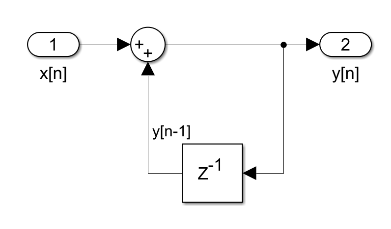

2.2.1


i. ii.

 $$ y\left\lbrack n\right\rbrack =x\left\lbrack n\right\rbrack -x\left\lbrack n-1\right\rbrack $$ 

 $$ y\left\lbrack n\right\rbrack =y\left\lbrack n-1\right\rbrack +x\left\lbrack n\right\rbrack $$ 

iii. 





2.2.2


(2.3)

 $$ y\left\lbrack n\right\rbrack =\frac{1}{3}\left(x\left\lbrack n\right\rbrack +x\left\lbrack n-1\right\rbrack +x\left\lbrack n-2\right\rbrack \right) $$ 


 $$ h\left\lbrack n\right\rbrack =\frac{1}{3}\left(\delta \left\lbrack n\right\rbrack +\delta \left\lbrack n-1\right\rbrack +\delta \left\lbrack n-2\right\rbrack \right) $$ 

(2.4)

 $$ y\left\lbrack n\right\rbrack =0\ldotp 8y\left\lbrack n-1\right\rbrack +0\ldotp 2x\left\lbrack n\right\rbrack $$ 


 $$ h\left\lbrack n\right\rbrack =0\ldotp 8h\left\lbrack n-1\right\rbrack +0\ldotp 2\delta \left\lbrack n\right\rbrack $$ 

(2.5)

 $$ y\left\lbrack n\right\rbrack =y\left\lbrack n-1\right\rbrack +\frac{1}{3}\left(x\left\lbrack n\right\rbrack -x\left\lbrack n-3\right\rbrack \right) $$ 


 $$ h\left\lbrack n\right\rbrack =h\left\lbrack n-1\right\rbrack +\frac{1}{3}\left(\delta \left\lbrack n\right\rbrack -\delta \left\lbrack n-3\right\rbrack \right) $$ 

Note that this formulation is equivalent with (2.3), because:


When $y\left\lbrack n-1\right\rbrack =\frac{1}{3}\left(x\left\lbrack n-1\right\rbrack +x\left\lbrack n-2\right\rbrack +x\left\lbrack n-3\right\rbrack \right)$ (from 2.3):


 $y\left\lbrack n\right\rbrack =\frac{1}{3}\left(x\left\lbrack n-1\right\rbrack +x\left\lbrack n-2\right\rbrack +x\left\lbrack n-3\right\rbrack \right)+\frac{1}{3}\left(x\left\lbrack n\right\rbrack -x\left\lbrack n-3\right\rbrack \right)=\frac{1}{3}\left(x\left\lbrack n\right\rbrack +x\left\lbrack n-1\right\rbrack +x\left\lbrack n-2\right\rbrack \right)$ ,


which is the same with (2.3).


Therefore, methods (2.3) and (2.5) are both known as moving averages because they computes the average value of the three most recent values. Method (2.4), however, seems to have a lagging characteristic, and does not compute average values.


2.3

```matlab
clear,figure
n=-10:20;
x1 = zeros(1,31);
x1(n==0) = 1;
x1(n==5) = -1;

subplot(311)
stem(n,x1), title('Original Sig 1')

subplot(312)
y1 = differentiate(x1);
stem(n,y1), title('Differentiated Sig 1')

subplot(313)
z1 = integrate(x1);
stem(n,z1), title('Integrated Sig 1')
```


```matlab
figure
subplot(311)
x2 = (n>=0)-(n-11>=0);
stem(n, x2), title('Original Sig 2')
y2 = differentiate(x2);
z2 = integrate(x2);
subplot(312)
stem(n,y2), title('Differentiated Sig 2')
subplot(313)
stem(n,z2), title('Integrated Sig 2')
```


Differentiator is stable, because:


Assume $|y\left\lbrack n\right\rbrack |<B_y <\infty \;\;\;\;\forall n$ 

 $$ y\left\lbrack n\right\rbrack -y\left\lbrack n-1\right\rbrack \le |y\left\lbrack n\right\rbrack |+|y\left\lbrack n-1\right\rbrack |\le 2B_y <\infty $$ 


Integrator is unstable, because:

 $$ \sum_{n=-\infty }^{\infty } |h\left\lbrack n\right\rbrack |=\sum_{n=0}^{\infty } 1=\infty $$ 

2.4


S1


S2


S3


S4


S5


```matlab
clear, figure

[n, delta]=impulse(-1,6);
% stem(n, delta)

y1 = S1(delta);
subplot(511)
sgtitle('Impulse Response of Systems')
stem(n,y1), title('S1')
y2 = S2(delta);
subplot(512), stem(n,y2), title('S2')
subplot(513), stem(n, S1(S2(delta))), title('S1(S2)')
subplot(514), stem(n, S2(S1(delta))), title('S2(S1)')
subplot(515), stem(n, S1(delta)+S2(delta)), title('S1+S2')
```


The plots show that commutivity, additivity is conserved for these two systems.


2.5

```matlab
clear, figure
[audio_data, fs] = audioread('guidance/music.au');
% audio_data = audio_data(1:20000);

sound1 = S1(audio_data);
sound2 = S2(audio_data);

% sound(audio_data, fs);
% pause(3)
% sound(sound1, fs)
% pause(3)
% sound(sound2, fs)
subplot(311)
sgtitle('Plots of Voices')
plot(audio_data), title('Original')
subplot(312), plot(sound1), title('S1-Filtered')
subplot(313), plot(sound2), title('S2-Filtered')
```


```matlab
figure
omega = linspace(-pi,pi,length(audio_data));
freq = abs(fftshift(fft(audio_data)));
freq_1 = abs(fftshift(fft(sound1)));
freq_2 = abs(fftshift(fft(sound2)));
sgtitle('Frequency Spectrum')
subplot(311),plot(omega, freq), title('Original')
subplot(312),plot(omega, freq_1), title('Through S1')
subplot(313),plot(omega, freq_2), title('Through S2')
```


```matlab
clear, figure
```

 $$ y\left\lbrack n\right\rbrack =x\left\lbrack n\right\rbrack -\frac{1}{2}\left\lbrack n-1\right\rbrack $$ 


```matlab
[n, delta]=impulse(-5,11);
y=S2(delta);
z=S3(y);
subplot(211), sgtitle('Inverse Systems')
stem(n,y), title('Original System')
subplot(212), stem(n,z), title('Inverse System')
```


2.7

```matlab
clear, figure

[n, x1] = impulse(-5,11);

[y11,y12,y13]=get_outputs(x1);

draw_outputs('Impulse Responses', n,y11,y12,y13)
```


```matlab
x1d = [0,x1(1:end-1)];
[y11d,y12d,y13d]=get_outputs(x1d);
draw_outputs('Delayed Responses',n,y11d,y12d,y13d)
```


Therefore bbox1 is TI.

```matlab
clear,figure

n=0:100;
n=n/100*2*pi;
x1=sin(n);x2=cos(n);
% subplot(211),stem(n,x1), title('Sine')
% subplot(212),stem(n,x2), title('Cosine')
% sgtitle('Input Functions: Sine and Cosine'), xlabel('n')
[y1,y2,y3]=get_outputs(x1);
draw_outputs('Response of a Sine', n, y1,y2,y3)
```


```matlab
[z1,z2,z3]=get_outputs(x2);
draw_outputs('Response of a Cosine', n, z1,z2,z3)
```


```matlab
x3=x1+x2;
% figure,stem(n,x3),title('Sum of Inputs'),xlabel('n'),ylabel("x1+x2")
[a1,a2,a3]=get_outputs(x3);
draw_outputs("Output of the Sum", n, a1,a2,a3)
```


```matlab
draw_outputs("Sum of the Outputs", n, y1+z1,y2+z2,y3+z3)
```


```matlab
draw_pair(n,a3,y3+z3,"Output of the Sum", "Sum of the Outputs", "bbox3 Linearity Check")
```


 $$ f\left(\alpha x_1 +\beta x_2 \right)\not= f\left(\alpha x_1 \right)+f\left(\beta x_2 \right) $$ 

Therefore, bbox3 is non\-linear.


2.8

```matlab
clear, figure
```

Recall:


(2.4)

 $$ y\left\lbrack n\right\rbrack =0\ldotp 8y\left\lbrack n-1\right\rbrack +0\ldotp 2x\left\lbrack n\right\rbrack $$ 

 $$ h\left\lbrack n\right\rbrack =0\ldotp 8h\left\lbrack n-1\right\rbrack +0\ldotp 2\delta \left\lbrack n\right\rbrack $$ 

(2.5)

 $$ y\left\lbrack n\right\rbrack =y\left\lbrack n-1\right\rbrack +\frac{1}{3}\left(x\left\lbrack n\right\rbrack -x\left\lbrack n-3\right\rbrack \right) $$ 

 $$ h\left\lbrack n\right\rbrack =h\left\lbrack n-1\right\rbrack +\frac{1}{3}\left(\delta \left\lbrack n\right\rbrack -\delta \left\lbrack n-3\right\rbrack \right) $$ 
```matlab
rates = load('guidance/stockrates.mat').rate;

rates_1 = filtering24(rates);
rates_2 = filtering25(rates);

subplot(311)
sgtitle('Stock Rates Data')
stem(rates), title('Original Rate')
subplot(312)
stem(rates_1), title('Filtered with (2.4)')
subplot(313)
stem(rates_2), title('Filtered with (2.5)')
```


```matlab
figure, subplot(311)
stem(filtering25_improved(rates))
```


