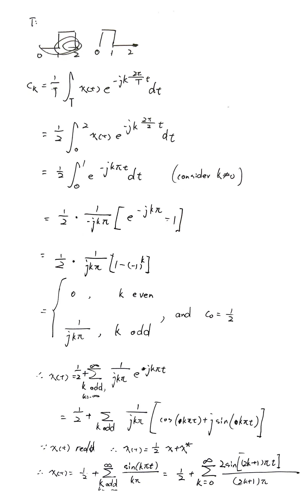

# Lab 3 \- Frequency Analysis
# 3.2
#
# 3.2.1 Synthesis of Periodic Signals

Recall:

### i: Compute the Fourier series expansion


Sig1:




```matlab
t=linspace(0,2,1000);
x=[ones(1,500),zeros(1,500)];
plot(t,x), xlabel('t'),ylabel('s(t)')
title('Signal 1'), ylim([-0.5,1.5])
```


Sig2:


```matlab
x(:)=-1/2;
x(251:750)=1/2;
t=t/2-1/2;
figure
plot(t,x), xlabel('t'),ylabel('s(t)')
title('Signal 2'), ylim([-1,1])
```


# 3.4 CT Frequency Analysis
## 3.4.1

The default synthesized signal:

```matlab
clear,figure
show_fig("34_1.fig")
```


Sig 1:

```matlab
show_fig("34_2.fig")
```


Sig 2:

```matlab
show_fig("34_3.fig")
```


Comment:


Gibbs' Phenomena can be found in all of the plots.

## 3.4.2 Modulation Property
```matlab
clear,figure
% 定义时间向量和输出向量
time_values = [0 0.5 1 2];
output_values = [0 1 0 0];

% 绘制信号
figure;
plot(time_values, output_values, '-o');
title('Repeating Sequence Signal');
xlabel('Time (s)');
ylabel('Amplitude');
grid on;
axis([0 2 -0.2 1.2]);
```


```matlab
show_fig("342_1.fig")
```


```matlab
show_fig("342_2.fig")
```


```matlab
show_fig("342_3.fig")
```


```matlab
show_fig("342_4.fig")
```

Comment:


1) The modulating frequency determines how the spectrum is moved horizontally.


2) The original periodic signal's spectrum is discrete (Fourier Series), hence there is a comb structure.


The distance between impulses is $f_0$ , which is the fundamental frequency of the signal.


3) As the period increases, the spectrum becomes more compact, and converges to a continuous spectrum.

## 3.5 DT Frequency Analysis
```matlab
clear,figure

dw = 1/1000;
omega = -pi:dw:pi;

x1 = 1; n0_1 = 0;
X1=DTFT(x1,n0_1,dw);

x2 = 1; n0_2 = 5;
X2=DTFT(x2,n0_2,dw);

x3 = logspace(1, 0.5^99, 100);
n0_3 = 0;
X3=DTFT(x3,n0_3,dw);

plot_DTFT(omega,X1)
```


```matlab
plot_DTFT(omega,X2)
```


```matlab
plot_DTFT(omega,X3)
```


```matlab
clear
```

12210714

