# Lab 4 \- Discrete Fourier Transform
# 4.2.3 Windowing Effects

1. Submit the plot of the phase and magnitude of ().

```matlab
clear, figure

N = 20;

get_W_ejw(20, 1025, true)
```

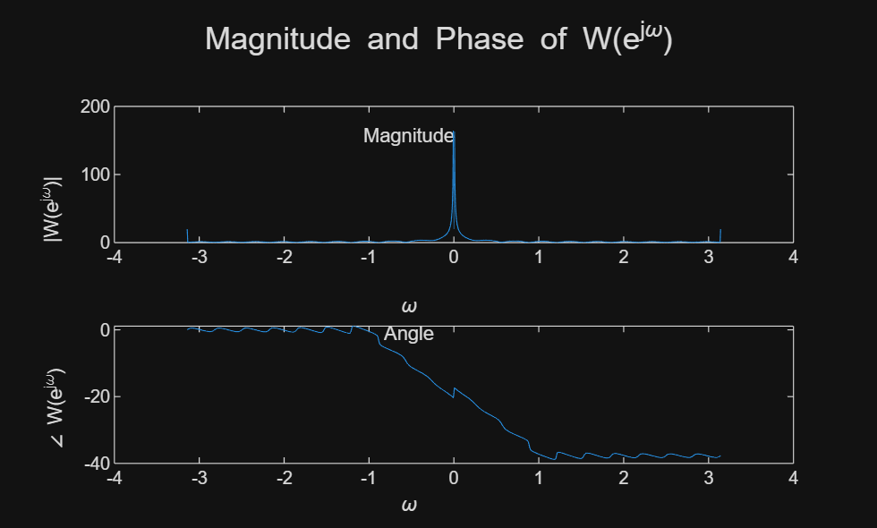

```matlabTextOutput
ans = 1x1025
   -3.1416   -3.1355   -3.1293   -3.1232   -3.1170   -3.1109   -3.1048   -3.0986   -3.0925   -3.0864   -3.0802   -3.0741   -3.0680   -3.0618   -3.0557   -3.0496   -3.0434   -3.0373   -3.0311   -3.0250   -3.0189   -3.0127   -3.0066   -3.0005   -2.9943   -2.9882   -2.9821   -2.9759   -2.9698   -2.9637   -2.9575   -2.9514   -2.9452   -2.9391   -2.9330   -2.9268   -2.9207   -2.9146   -2.9084   -2.9023   -2.8962   -2.8900   -2.8839   -2.8777   -2.8716   -2.8655   -2.8593   -2.8532   -2.8471   -2.8409

```

 2. Submit the analytical expression for ().


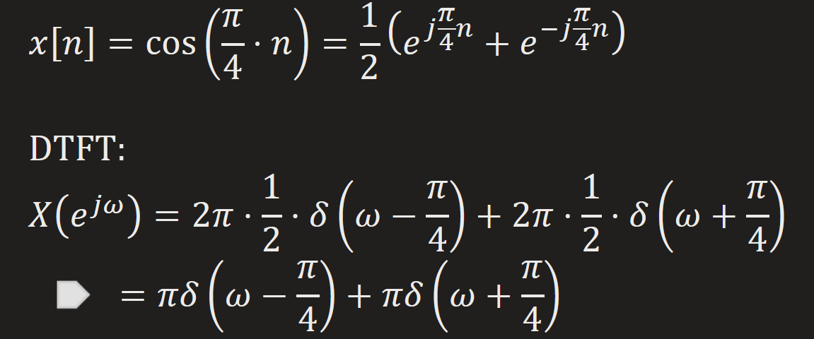


 3. Submit the magnitude plot of  tr().

```matlab
n=0:19;
x=cos(pi/4*n);
[X, w]=DTFT(x, 512);
figure
plot(w, abs(X)), xlabel('\omega'), ylabel('|X_{tr}(e^{j\omega})|'), title('Magnitude of X_{tr}')
```

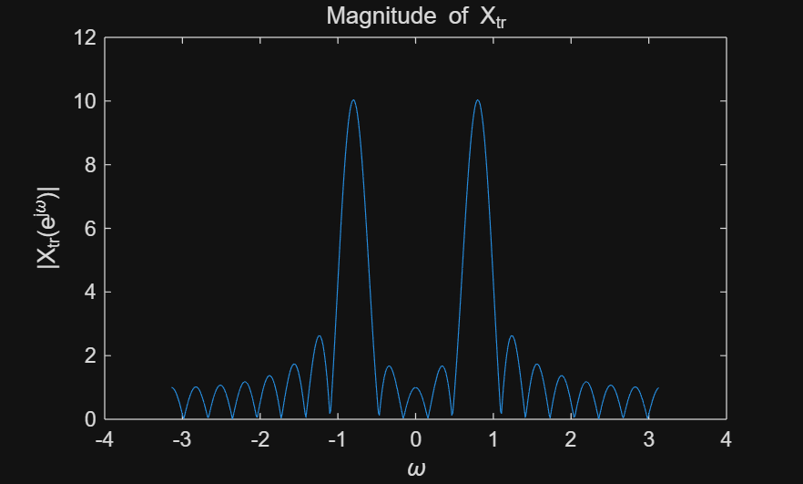

 4. Describe the difference between | tr()| and |()| . What is the reason for this  difference? 


They both reaches peak at $\pm \frac{\pi }{4}$ , but the latter has continuous instead of discrete values spreading the whole domain, and contains ripples.


This is caused by the "spectral leakage" due to truncation.


 5. Comment on the effects of using a different length of the window ().  

```matlab
figure
nums=[10, 20, 40, 80];
plot_different_DTFT(x, nums)
```

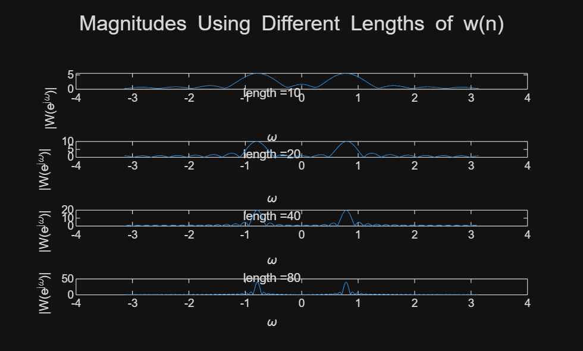

The larger the window, the more the DFT approaches DTFT (less spectral leakage). If the window's length approaches infinity, the DFT approaches the DTFT.

# 4.3 The Discrete Fourier Transform
## 4.3.1 Computing the DFT 
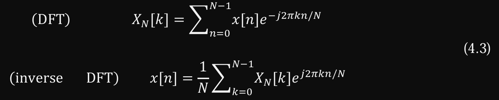

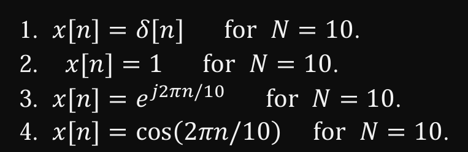

```matlab
clear,figure;
n=0:9;
x1=zeros(1,10);x1(1)=1;
x2=ones(1,10);
x3=exp(1j*2*pi*n/10);
x4=cos(2*pi*n/10);
Xs = cellfun(@DFTsum, {x1,x2,x3,x4}, 'UniformOutput', false);
[X1,X2,X3,X4] = Xs{:};

plot_DFTs([X1;X2;X3;X4], n)
```

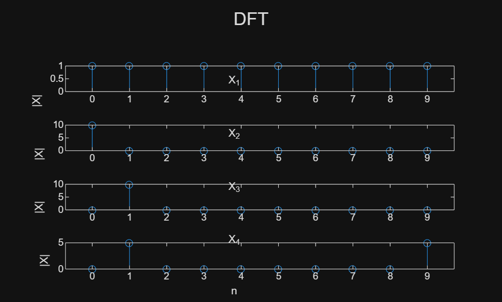

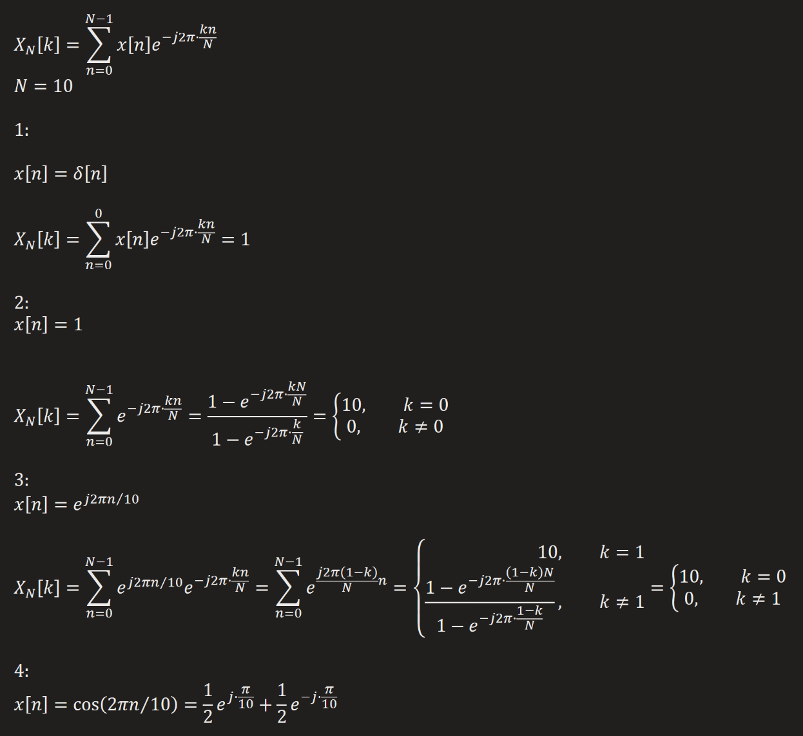


```matlab
zs = cellfun(@IDFTsum, {X1,X2,X3,X4}, 'UniformOutput', false);
[z1,z2,z3,z4] = zs{:};

plot_IDFTs([z1;z2;z3;z4], n)
```

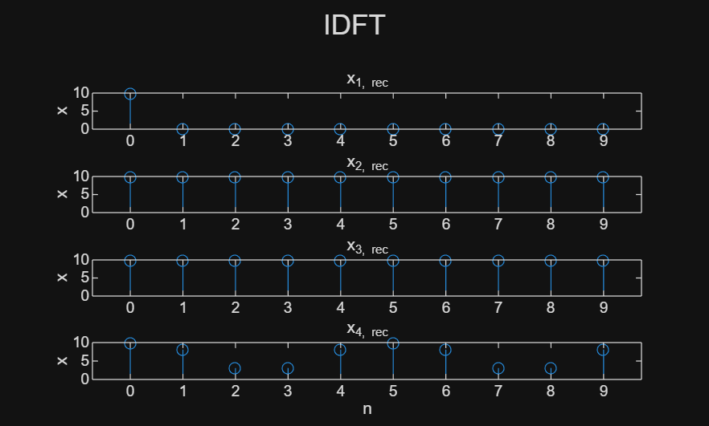

The results of IDFT are the same with the original signals.

## 4.3.2 Matrix Representation of the DFT 
```matlab
DFTmatrix(5)
```

```matlabTextOutput
ans = 5x5 complex
1.0000 + 0.0000i   1.0000 + 0.0000i   1.0000 + 0.0000i   1.0000 + 0.0000i   1.0000 + 0.0000i
2. 0000 + 0.0000i   0.3090 - 0.9511i  -0.8090 - 0.5878i  -0.8090 + 0.5878i   0.3090 + 0.9511i
3. 0000 + 0.0000i  -0.8090 - 0.5878i   0.3090 + 0.9511i   0.3090 - 0.9511i  -0.8090 + 0.5878i
4. 0000 + 0.0000i  -0.8090 + 0.5878i   0.3090 - 0.9511i   0.3090 + 0.9511i  -0.8090 - 0.5878i
5. 0000 + 0.0000i   0.3090 + 0.9511i  -0.8090 + 0.5878i  -0.8090 - 0.5878i   0.3090 - 0.9511i

```

```matlab
A=DFTmatrix(10);
X_s=A*[x1.',x2.',x3.'];
plot_DFTs(X_s.', n), sgtitle('DFT Using Matrix')
```

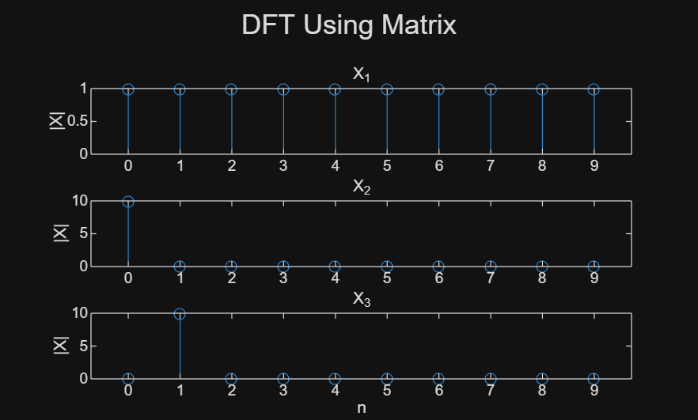

 $N^2$ multiplications are needed.


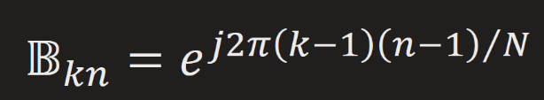

```matlab
A=DFTmatrix(5)
```

```matlabTextOutput
A = 5x5 complex
1.0000 + 0.0000i   1.0000 + 0.0000i   1.0000 + 0.0000i   1.0000 + 0.0000i   1.0000 + 0.0000i
2. 0000 + 0.0000i   0.3090 - 0.9511i  -0.8090 - 0.5878i  -0.8090 + 0.5878i   0.3090 + 0.9511i
3. 0000 + 0.0000i  -0.8090 - 0.5878i   0.3090 + 0.9511i   0.3090 - 0.9511i  -0.8090 + 0.5878i
4. 0000 + 0.0000i  -0.8090 + 0.5878i   0.3090 - 0.9511i   0.3090 + 0.9511i  -0.8090 - 0.5878i
5. 0000 + 0.0000i   0.3090 + 0.9511i  -0.8090 + 0.5878i  -0.8090 - 0.5878i   0.3090 - 0.9511i

```

```matlab
B=IDFTmatrix(5)
```

```matlabTextOutput
B = 5x5 complex
   0.2000 + 0.0000i   0.2000 + 0.0000i   0.2000 + 0.0000i   0.2000 + 0.0000i   0.2000 + 0.0000i
   0.2000 + 0.0000i   0.0618 + 0.1902i  -0.1618 + 0.1176i  -0.1618 - 0.1176i   0.0618 - 0.1902i
   0.2000 + 0.0000i  -0.1618 + 0.1176i   0.0618 - 0.1902i   0.0618 + 0.1902i  -0.1618 - 0.1176i
   0.2000 + 0.0000i  -0.1618 - 0.1176i   0.0618 + 0.1902i   0.0618 - 0.1902i  -0.1618 + 0.1176i
   0.2000 + 0.0000i   0.0618 - 0.1902i  -0.1618 - 0.1176i  -0.1618 + 0.1176i   0.0618 + 0.1902i

```

```matlab
C=B*A
```

```matlabTextOutput
C = 5x5 complex
1.0000 + 0.0000i  -0.0000 - 0.0000i  -0.0000 - 0.0000i   0.0000 - 0.0000i   0.0000 - 0.0000i
  -0.0000 + 0.0000i   1.0000 - 0.0000i  -0.0000 - 0.0000i   0.0000 - 0.0000i   0.0000 - 0.0000i
   0.0000 + 0.0000i  -0.0000 + 0.0000i   1.0000 - 0.0000i  -0.0000 - 0.0000i  -0.0000 - 0.0000i
   0.0000 + 0.0000i   0.0000 + 0.0000i   0.0000 - 0.0000i   1.0000 + 0.0000i  -0.0000 - 0.0000i
   0.0000 + 0.0000i   0.0000 + 0.0000i  -0.0000 + 0.0000i  -0.0000 + 0.0000i   1.0000 + 0.0000i

```

C is an identity matrix. This is obvious because:


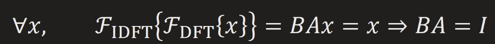

## 4.3.3 Computation Time Comparison 
```matlab
clear
n=0:511;
x=cos(2*pi*n/10);
A=DFTmatrix(512);

t=cputime;
for i=1:100
    X=DFTsum(x);
end
% X=DFTsum(x);
disp(cputime-t)
```

```matlabTextOutput
    2.2031
```

```matlab
t=cputime;
for i=1:1000 % Note that this is ten-fold!
    X=A*x.';
end
disp(cputime-t)
```

```matlabTextOutput
    0.2656
```

```matlab
clear
```

The matrix method is faster, while requiring more storage which is $O\left(N^2 \right)$ instead of $O\left(N\right)$ .


To explain clearly, method 1 requires $2N$ storage, while method 2 requires $N^2 +2N$ storage.


Method 1 uses `for` loop and computes $W_N$ for each addition.


Method 2 benefits from optimized algorithms in MATLAB, and $W_N$ is pre\-calculated in `DFTmatrix()`.

