# **Lab 7 \- Digital Filter Design**
# **7.3 Design of a Simple FIR Filter**

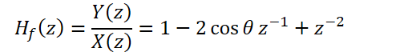


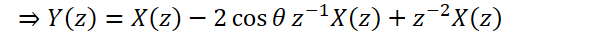


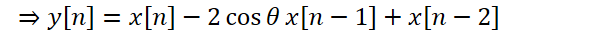


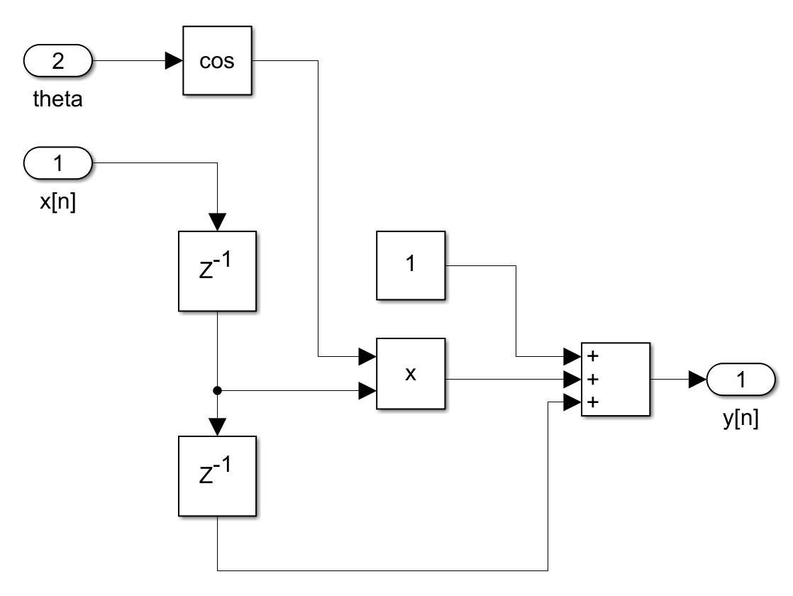

```matlab
function plotFreqRes79(theta)
    num = [1, -2*cos(theta), 1];
    den = 1;
    freqz(num, den), sgtitle(['|H_f| at \theta = ', num2str(theta/pi), '\pi'])
    % [h, w] = freqz(num, den)
    figure
    zplane(num, den)
    
end

plotFreqRes79(pi/6)
```

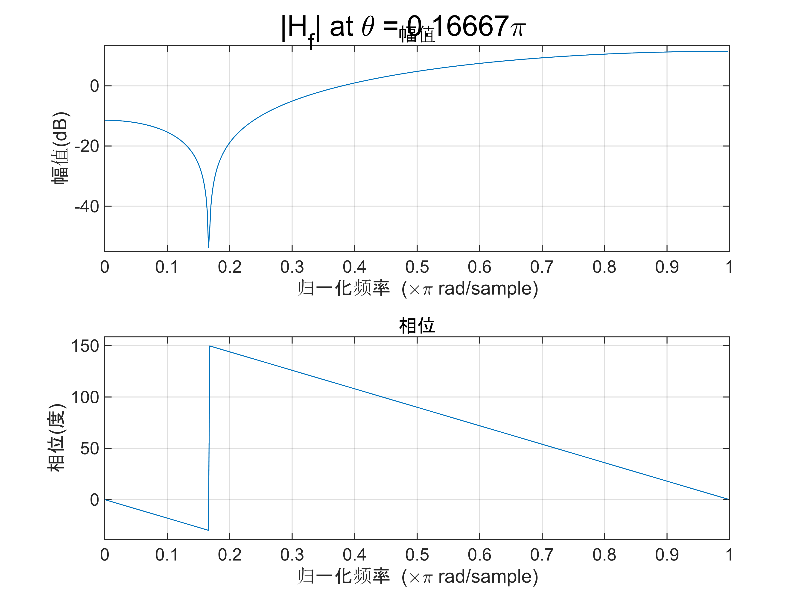

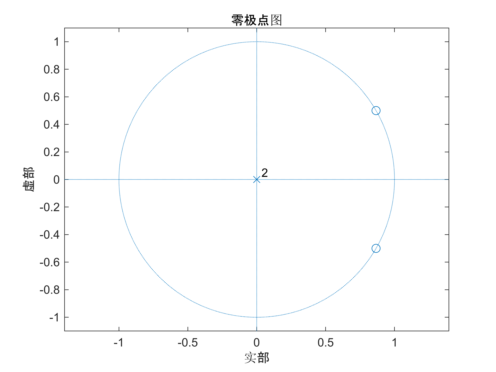

```matlab
plotFreqRes79(pi/3)
```

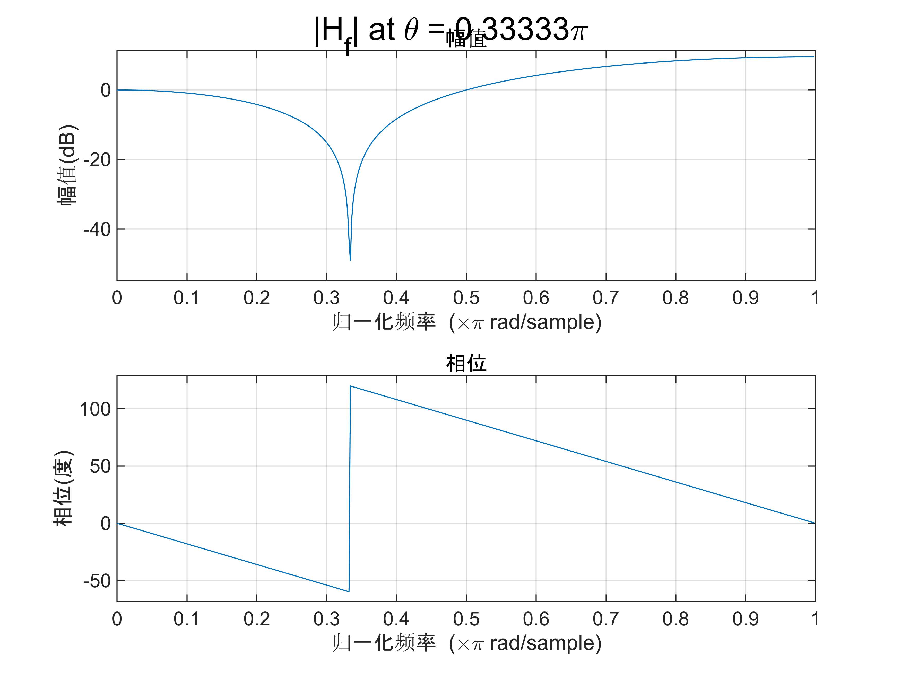

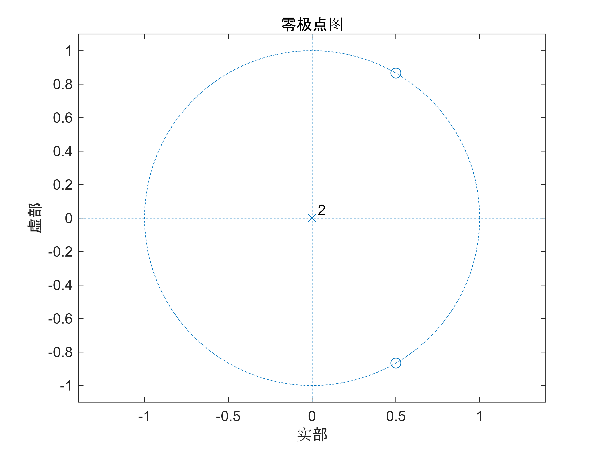

```matlab
plotFreqRes79(pi/2)
```

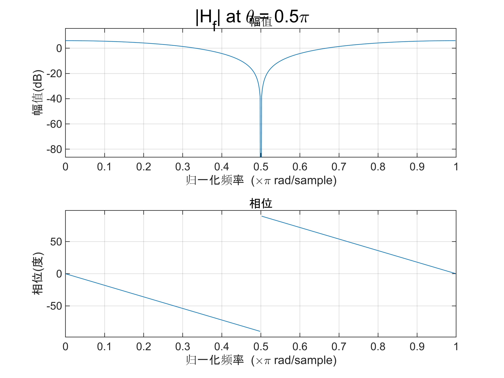

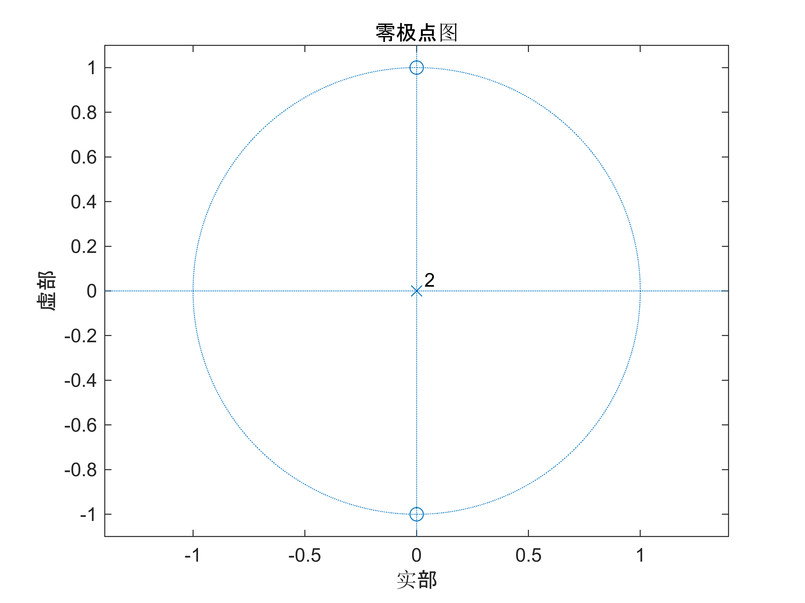

The magnitude of the frequency response approaches zero at theta. A phase change happens there as well.

```matlab
clear, figure
load('resource\nspeech1.mat')
% sound(nspeech1)
[X, w] = DTFT(nspeech1(100:1100), 0);
subplot(211)
plot(100:200, nspeech1(100:200)), title('Samples of nspeech1'), xlabel('Index'), ylabel('Magnitude')
subplot(212)
plot(w, abs(X)), title('DTFT of nspeech1'), xlabel('Frequency'), ylabel('Magnitude')
```

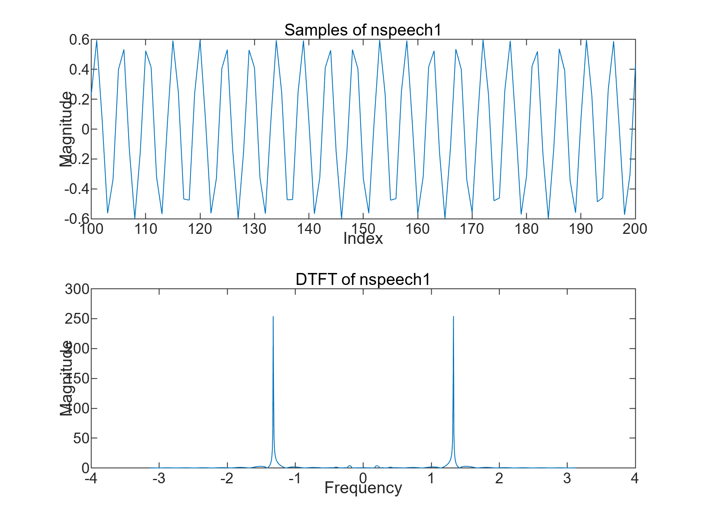

```matlab
[Xmax1, Imax1] = max(abs(X))
```

```matlabTextOutput
Xmax1 = 254.2287
Imax1 = 297
```

```matlab
theta = w(Imax1);
disp('theta:')
```

```matlabTextOutput
theta:
```

```matlab
disp([abs(num2str(theta/pi)), 'pi'])
```

```matlabTextOutput
-0.42188pi
```

```matlab
function y = FIRfilter(x)
    [X, w] = DTFT(x(100:1100), 0);
    [~, Imax] = max(abs(X));
    theta = w(Imax);
    filter = [1, -2*cos(theta), 1];
    y = conv(filter, x);  
end
y = FIRfilter(nspeech1);
% sound(y1)
figure, plot(100:200, y(100:200)), title('Filtered nspeech1'), xlabel('Frequency'), ylabel('Magnitude')
```

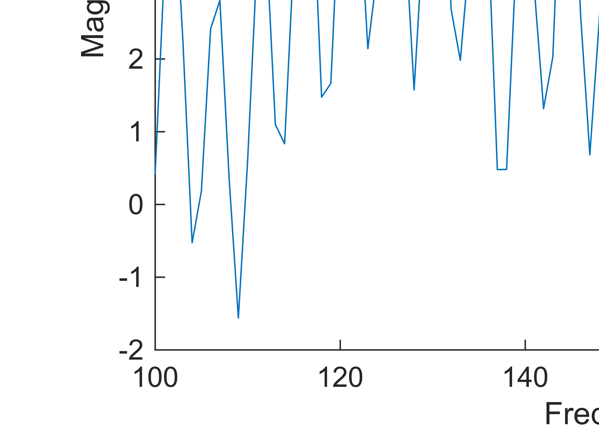

```matlab
[X, w] = DTFT(y(100:1100), 0);
plot(w, abs(X)), title('DTFT of Filtered nspeech1'), xlabel('Frequency'), ylabel('Magnitude')
```

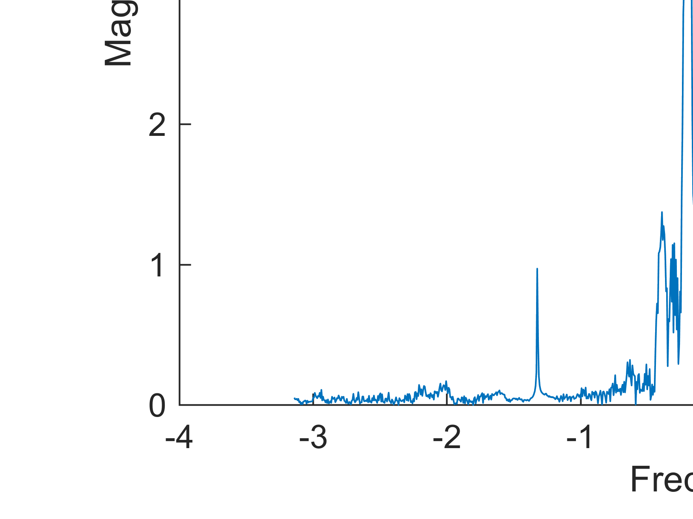

The peaks at theta is greatly reduced. Now the frequencies near zero are more eminent


The beep noise in the original sound is reduced through our bandstop filter.

# 7.4 Design of a Simple IIR Filter

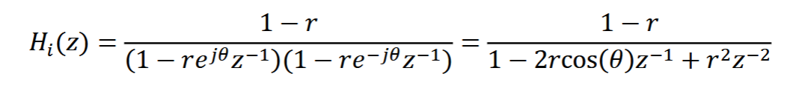


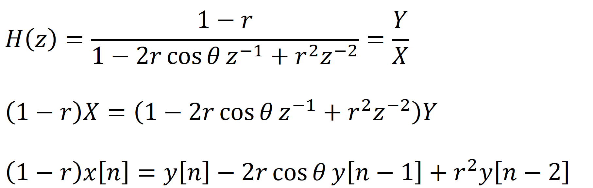


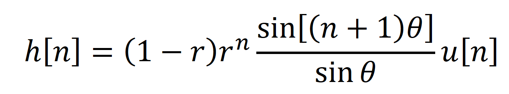

```matlab
function H = getIIRfilter(r, N, theta, showPlot)
    if nargin < 4
        showPlot = true;
    end
    if nargin < 3
        theta = pi/3;
    end
    if nargin == 1
        N = 1024;
    end

    w = linspace(-pi, pi, N);
    z =  exp(1j*w);
    H = (1-r) ./ (1-2*r*cos(theta)./z+r^2./(z.^2));
    
    if showPlot
        plot(w, abs(H))
    end
end

figure, hold on
getIIRfilter(0.99);getIIRfilter(0.9);getIIRfilter(0.7);
xlabel('\omega'), ylabel('|H(e{j\omega})|'), title('Magnitude of a IIR Filter')
legend('r=0.99', 'r=0.9', 'r=0.7')
```

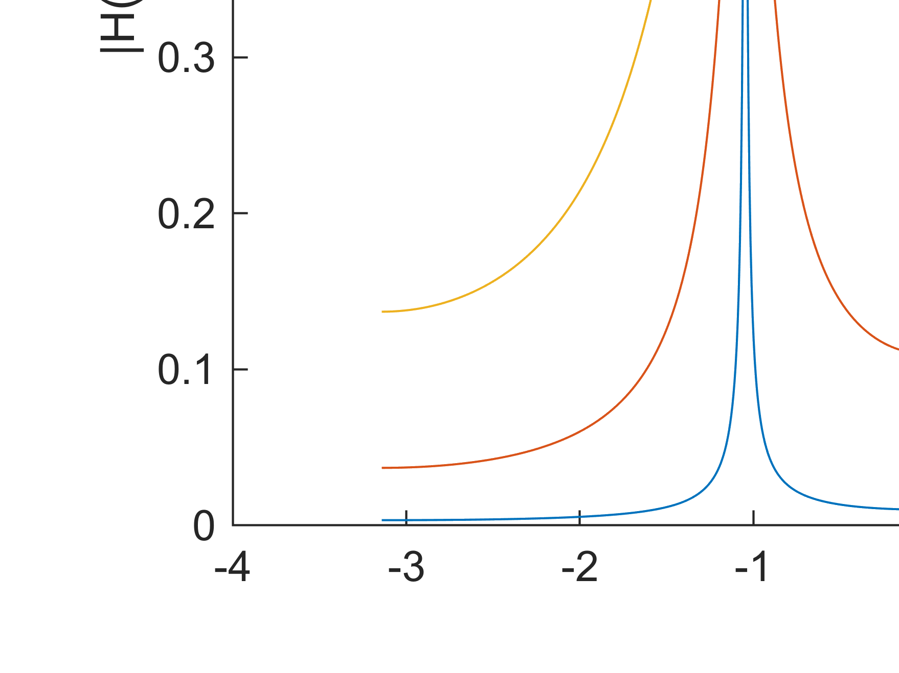

It can be seen that, the more close the r to the unit circle, the narrower the peaks.

```matlab
clear;
load('resource\pcm.mat');
% sound(pcm)
```

```matlab
function showSignal(x)
    figure
    subplot(211)
    plot(100:200, x(100:200)), title('Signal'), xlabel('Index'), ylabel('Magnitude')
    subplot(212)
    X = fftshift(fft(x(100:1100)));
    plot(linspace(-pi, pi, 1001), abs(X)), title('DTFT'), xlabel('\omega'), ylabel('|X|')
end

showSignal(pcm)
```

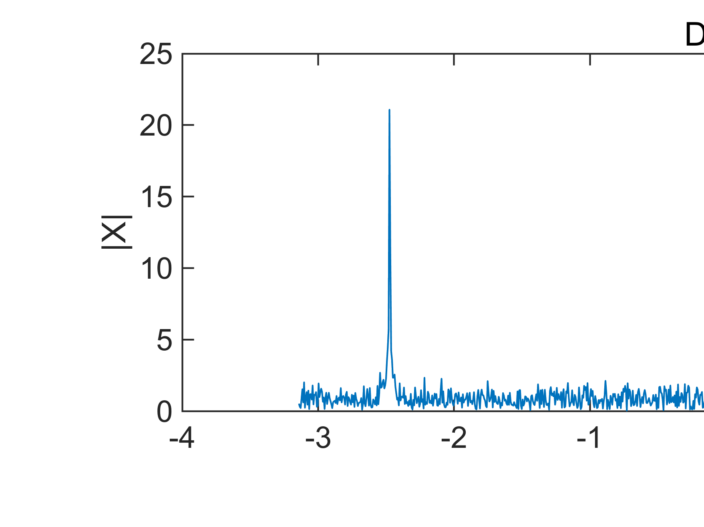

```matlab
pcmDTFT = fftshift(fft(pcm(100:1100)));
[~, idx] = max(pcmDTFT((end+1)/2:end));
theta = (idx-1)/500*pi
```

```matlabTextOutput
theta = 2.4756
```

```matlab
figure
realIdx = idx + 500;
idxWidth = ceil(0.02/(2*pi)*1001);
figure
plot(linspace(theta-0.02, theta+0.02,2*idxWidth+1), abs(pcmDTFT(realIdx - idxWidth:realIdx + idxWidth)))
title('Magitude Near Peak'), xlabel('\omega'), ylabel('|H|')
```

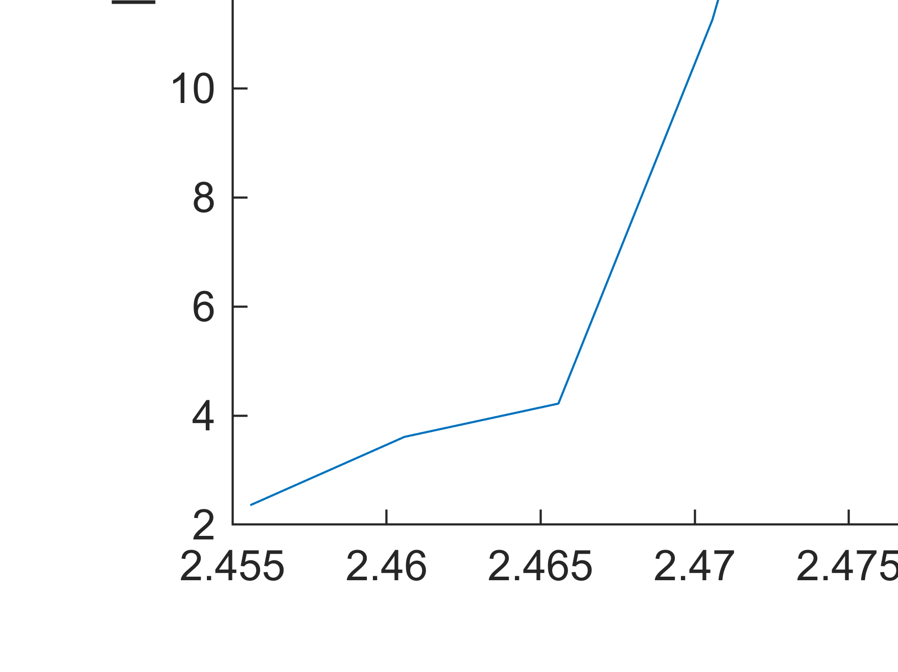


```matlab
function y = IIRfilter(x, r)
    if nargin == 1 
        r = 0.995;
    end
    theta = 2.4756;

    % p = 1-r
    p1 = 1 - r;
    % 2r cos(theta)
    k1 = 2* r * cos(theta);
    % r^2
    k2 = r^2;
    
    % p1*x[n] = y[n] - k1*y[n-1] + k2*y[n-2]

    N = length(x);
    y = zeros(1, N);

    y(1) = p1*x(1);
    y(2) = p1*x(2) + k1 * y(1);

    for i = 3:N
        y(i) = p1*x(i) + k1*y(i-1) - k2*y(i-2);
    end

end
y = IIRfilter(pcm);

showSignal(y), sgtitle('Filtered Signal')
```

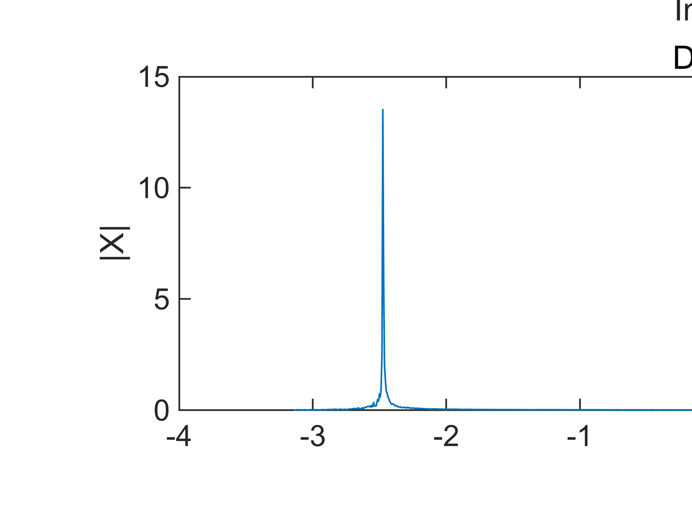

```matlab
showSignal(pcm), sgtitle('Original Signal')
```

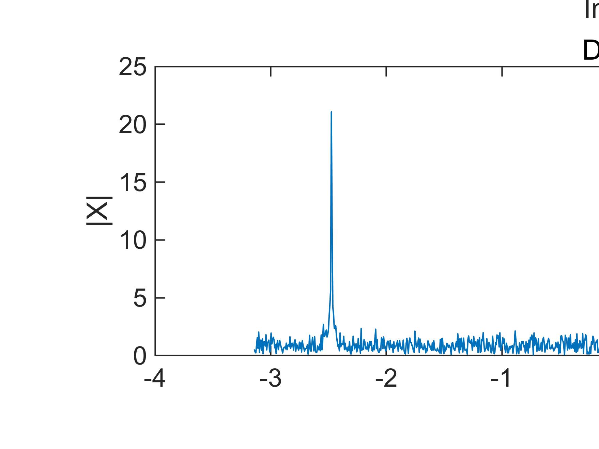

```matlab
z = IIRfilter(pcm, 0.9999999);
showSignal(z), sgtitle('Filter with r=0.9999999')
```

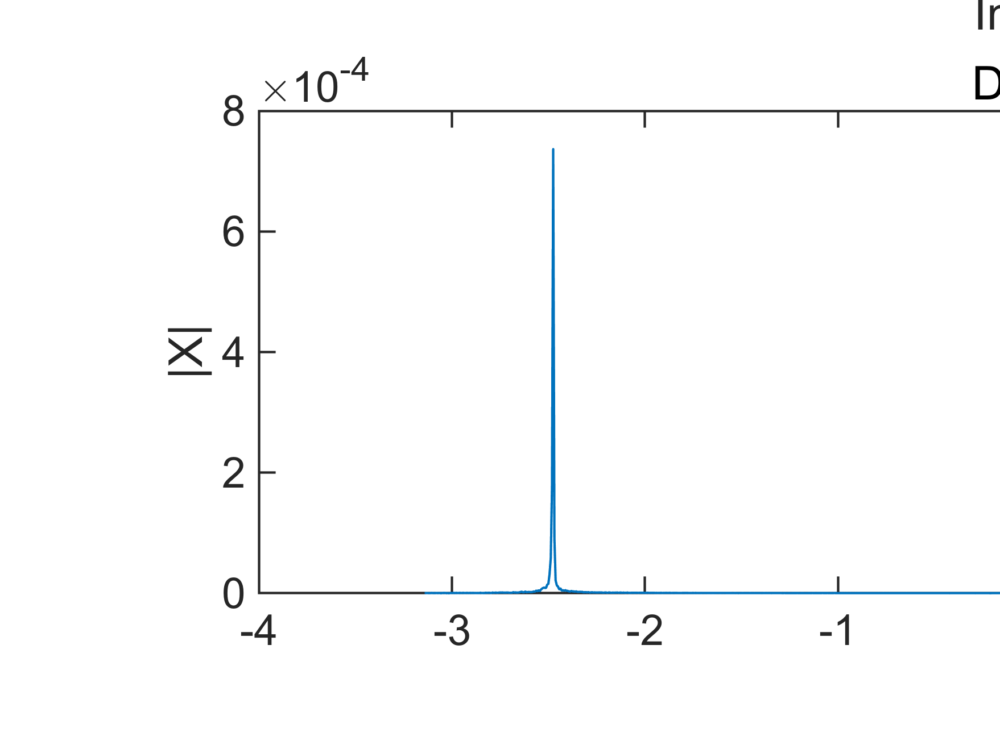

No sound can be heard. Because it is to close to the pole, very narrow frequency can pass the filter. And, quatification errors can be eminent.


Tests shows that, r close to 0.995 produce best results. Too small ones fail to remove noise. Too large ones removes the wanted signal. Note that r>1 leads to unstable filters.

# 7.5 Lowpass Filter Design Parameters
# 7.6 Filter Design Using Truncation
```matlab
clear, figure

load("resource\nspeech1.mat")
load("resource\nspeech2.mat")
% sound(nspeech1)
% sound(nspeech2)
```

```matlab
function h = LPFtrunc(N)
    wc = 2;
    
    mid = (N-1)/2;

    h = (wc/pi) * sinc((wc/pi) * ((0:N-1)-mid));
end
```

```matlab
figure
h1 = LPFtrunc(21);
h2 = LPFtrunc(101);
figure, 
subplot(211), stem(h1), xlabel('n'), ylabel('h'), title('h_{tr} (N=21)')
subplot(212), stem(h2), xlabel('n'), ylabel('h'), title('h_{tr} (N=101)')
```

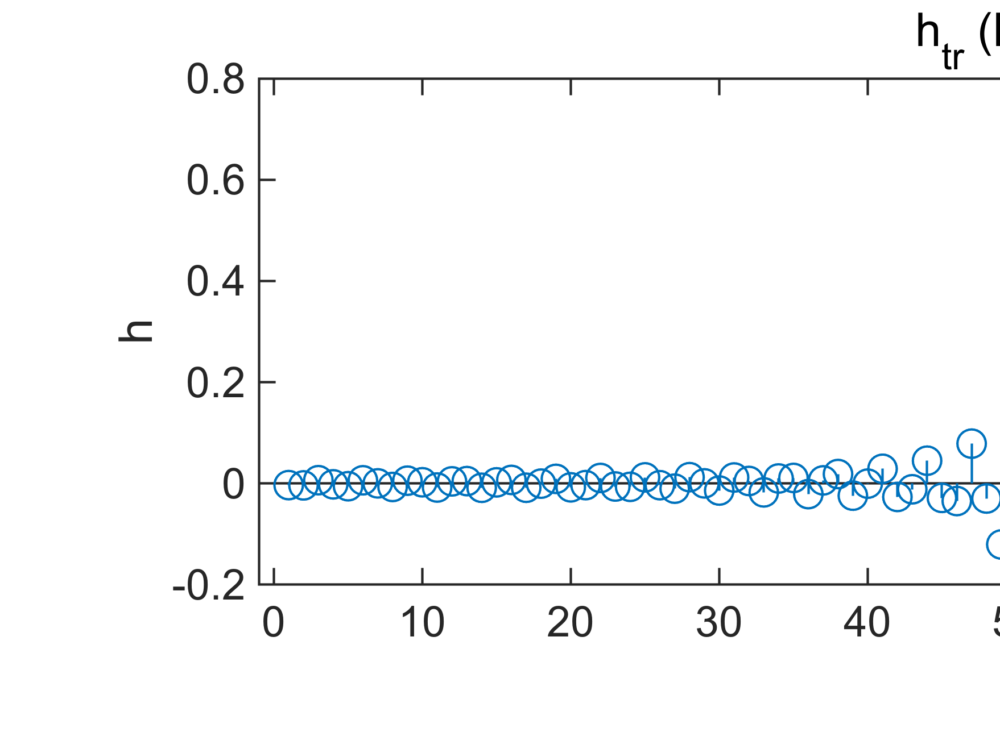

```matlab
function plot76(h)
    [X, w] = DTFT(h, 512);
    
    % 阈值定义
    passband_threshold = max(abs(X)) / sqrt(2); % 3 dB 对应的幅值
    stopband_threshold = 10^(-20 / 20) * max(abs(X));        % -60 dB 对应的幅值

    % 通带截止频率 (\omega_p)
    passband_idx = find(abs(X) >= passband_threshold, 1, 'first');
    wp = w(passband_idx);

    % 阻带起始频率 (\omega_s)
    stopband_idx = find(abs(X) >= stopband_threshold, 1, 'first')-1;
    ws = w(stopband_idx);

    % 绘图
    figure

    % 子图 1: 幅度响应
    subplot(311)
    plot(w, abs(X)), xlabel('\omega'), ylabel('|X|'), title('DTFT of h_{tr}')
    hold on
    xline([wp, -wp], '--g', 'LineWidth', 1.2);
    xline([ws, -ws], '--r', 'LineWidth', 1.2);

    text([wp-1.5, -wp+0.5], [0.5,0.5], 'Stopband', 'Color', 'Red')
    text(-0.5,0.5, 'Passband', 'Color','Green')
    wc = (abs(wp)+abs(ws))/2;
    text([-wc, wc], [0, 0], 'Transition', 'Rotation', 90)
    hold off

    % 子图 2: 对数幅度响应 (dB)
    subplot(312)
    plot(w, 20 * log10(abs(X))), xlabel('\omega'), ylabel('|X| (dB)'), title('(dB) DTFT of h_{tr}')
    hold on
    xline([wp, -wp], '--g', 'LineWidth', 1.2);
    xline([ws, -ws], '--r', 'LineWidth', 1.2);
    
    hold off

    % 子图 3: 相位响应
    subplot(313)
    plot(w, unwrap(angle(X))), xlabel('\omega'), ylabel('∠X'), title('Phase of h_{tr}')

    % 总标题
    sgtitle(['N=', num2str(length(h))])
    
    % 显示过渡带宽度
    % disp(['Transition bandwidth: ', num2str(abs(ws-wp))])
    % fprintf('通带截止频率 \\omega_p = %.3f\n', wp);
    % fprintf('阻带起始频率 \\omega_s = %.3f\n', ws);
    % fprintf('过渡带宽度 = %.3f\n', transition_bandwidth);
end

plot76(h1)
```

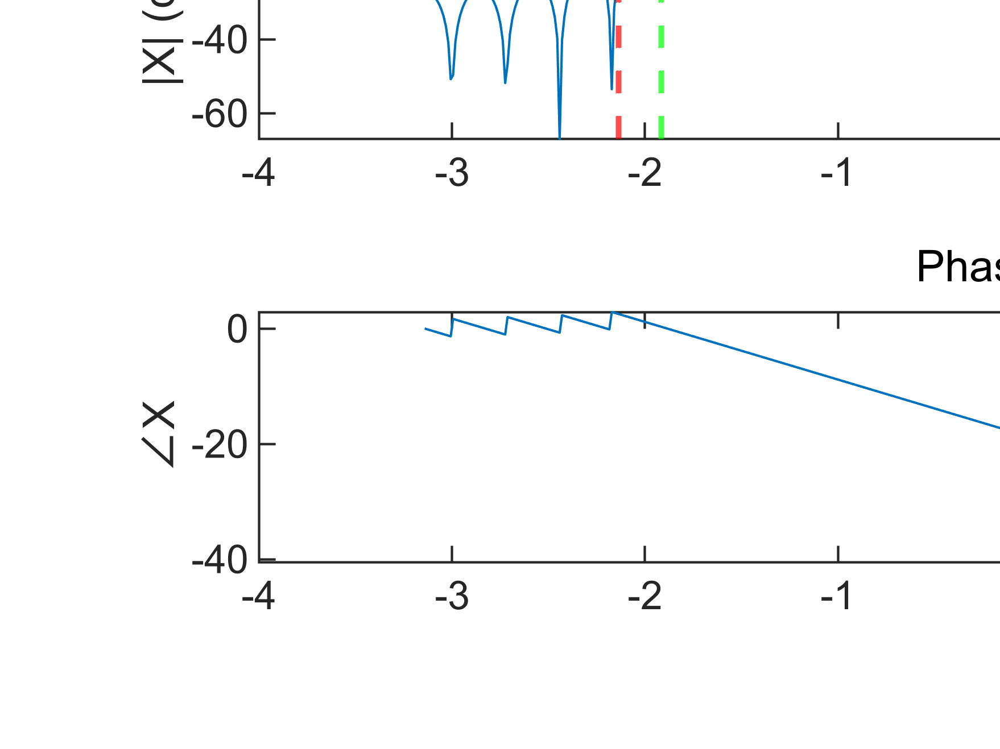

```matlab
plot76(h2)
```

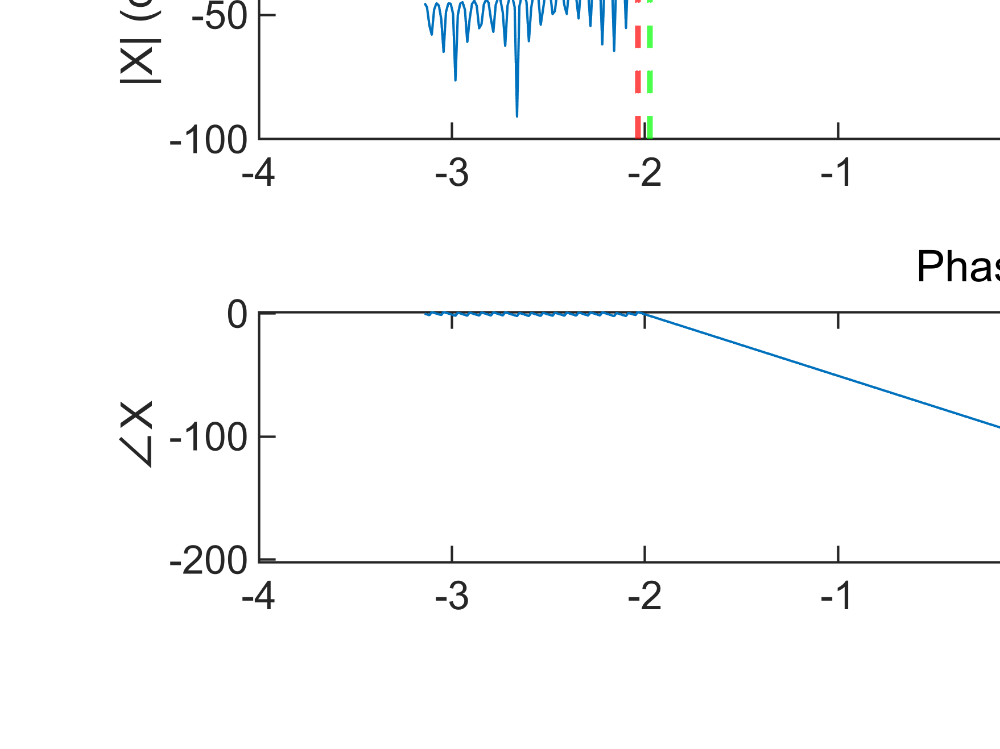

Obviously, the larger the N, the more simulative the frequency response to the rectangle. What's more, there will be more indense ripples, and the transition band is narrower.

```matlab
% showSignal(nspeech1), sgtitle('nspeech1')
showSignal(nspeech2), sgtitle('nspeech2')
```

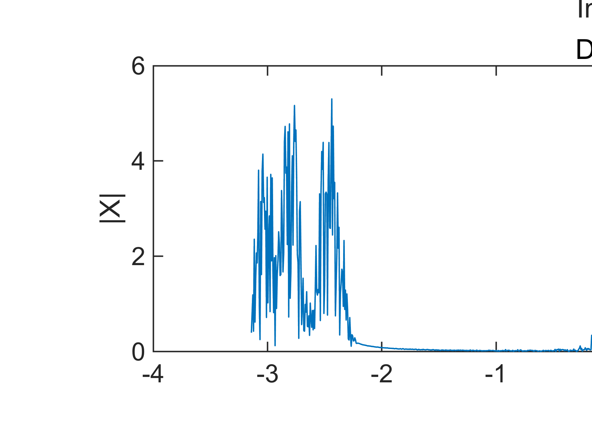

```matlab
showSignal(conv(h1, nspeech2)), sgtitle('Filtered with h, N=21')
```

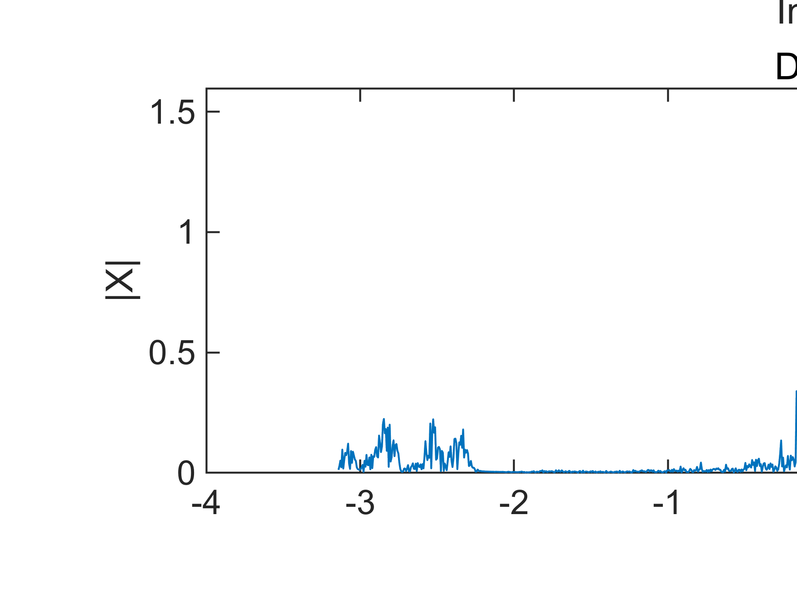

```matlab
showSignal(conv(h2, nspeech2)), sgtitle('Filtered with h, N=101')
```

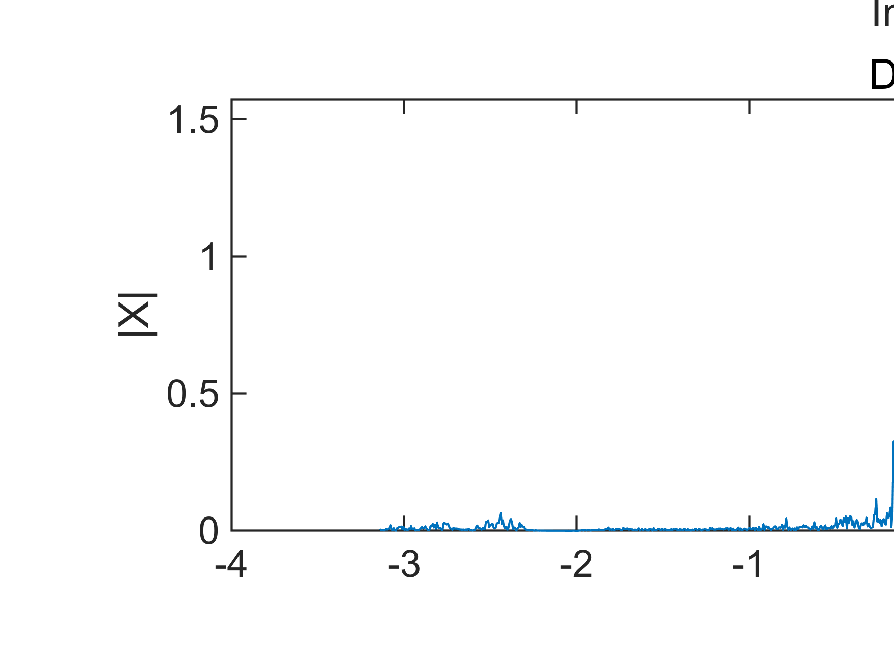

```matlab
% sound(3*conv(h1, nspeech2))
% sound(3*conv(h2, nspeech2))
```

The second filtered signal has less noise, which can be seen from the DTFT that the noise frequencies are lower. The longer the filter, the better the filtering.

# 7.7 Filter Design Using Standard Windows
```matlab
clear, figure
function plot77()
    
    h1 = ones(1, 21); s1 = 'Rectangle';
    h2 = hamming(21); s2 = 'Hamming';
    h3 = hann(21); s3 = 'Hanning';
    h4 = blackman(21); s4 = 'Blackman';

    hs = {h1,h2,h3,h4};
    ss = {s1,s2,s3,s4};
    
    figure
    for k = 1:4
        subplot(4,1,k), stem(0:20, hs{k}), title(ss{k}), ylabel('h')
    end
    xlabel('n'), sgtitle('Windows')

    figure
    for k = 1:4
        [X, w] = DTFT(hs{k}, 512);
        subplot(4,1,k), plot(w, abs(X)), title(ss{k}), ylabel('|H|')
    end
    xlabel('\omega'), sgtitle('DTFT of Windows')

    figure
    for k = 1:4
        [X, w] = DTFT(hs{k}, 512);
        subplot(4,1,k), plot(w, 20*log10(abs(X))), title(ss{k}), ylabel('|H|')
    end
    xlabel('\omega'), sgtitle('(dB) DTFT of Windows')

    

end
plot77()
```

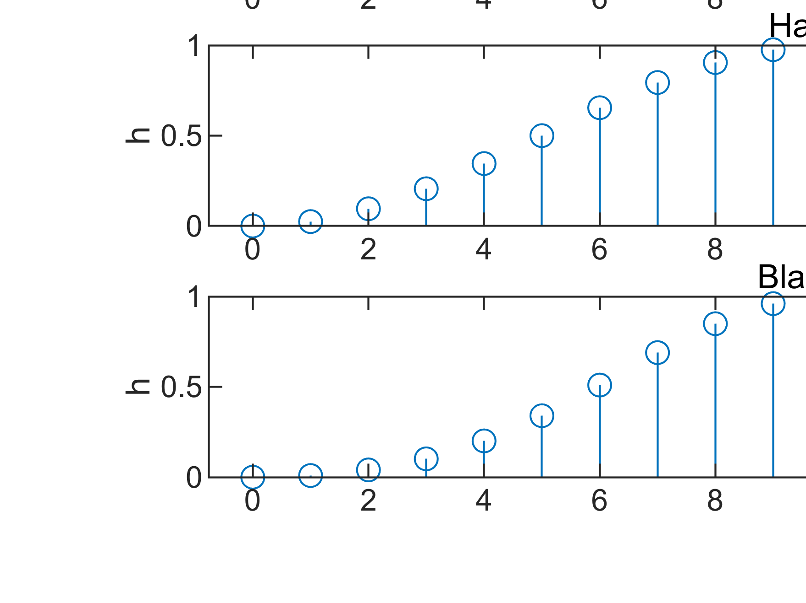

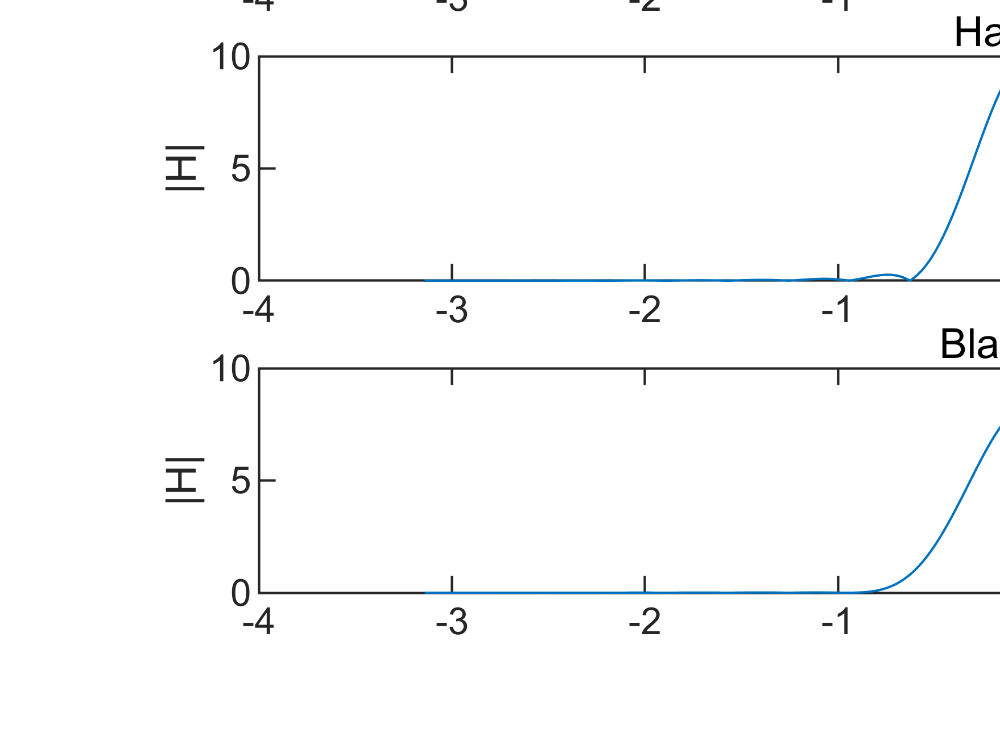

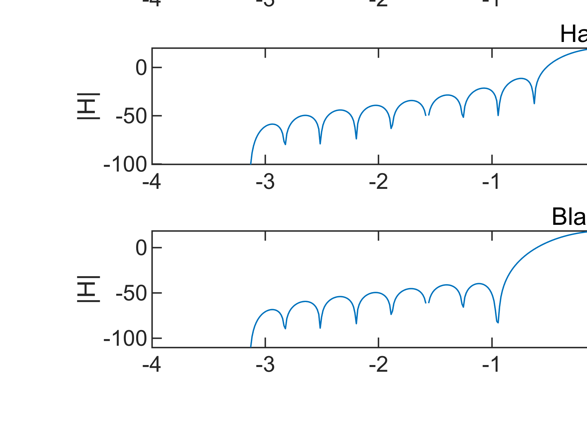
|      |      |      |      |      |
| :-- | :-- | :-- | :-- | :-- |
|  | Theo. Mainlobe Width <br>  | Meas. Mainlode Width <br>  | Theo. P\-to\-S (dB) <br>  | Meas. P\-to\-S (dB) <br>   |
| Rectangle <br>  | 0.5984 <br>  | 0.5890 <br>  | \-13 <br>  | \-13.1958 <br>   |
| Hamming <br>  | 1.1968 <br>  | 1.3499 <br>  | \-43 <br>  | \-41.6064 <br>   |
| Hanning <br>  | 1.1968 <br>  | 1.2517 <br>  | \-32 <br>  | \-31.4928 <br>   |
| Blackman <br>  | 1.7952 <br>  | 1.8899 <br>  | \-58 <br>  | \-58.2608 <br>   |
|      |      |      |      |       |


The larger the mainlobe width, the lower the sidelobe.

```matlab
function showFilter(h, Title)
    [X, w] = DTFT(h, 512);
    figure, subplot(311)
    stem(0:(length(h)-1), h), title('Filter'), xlabel('n'), ylabel('h')
    subplot(312)
    plot(w, abs(X)), title('DTFT of Filter'), xlabel('\omega'), ylabel('|H|')
    subplot(313)
    plot(w, 20*log10(abs(X))), title('(dB) DTFT of Filter'), xlabel('\omega'), ylabel('|H_{dB}|')
    sgtitle(Title)
end
clear
wc = 2; N = 21; n = 0:N-1;
h_ideal = wc/pi*sinc(wc/pi*(n-(N-1)/2));
w = 0.54 - 0.46*cos(2*pi*n/(N-1));
h = h_ideal.*w;

[X, w] = DTFT(h, 512);

showFilter(h, 'Filter with Hamming Window')
```

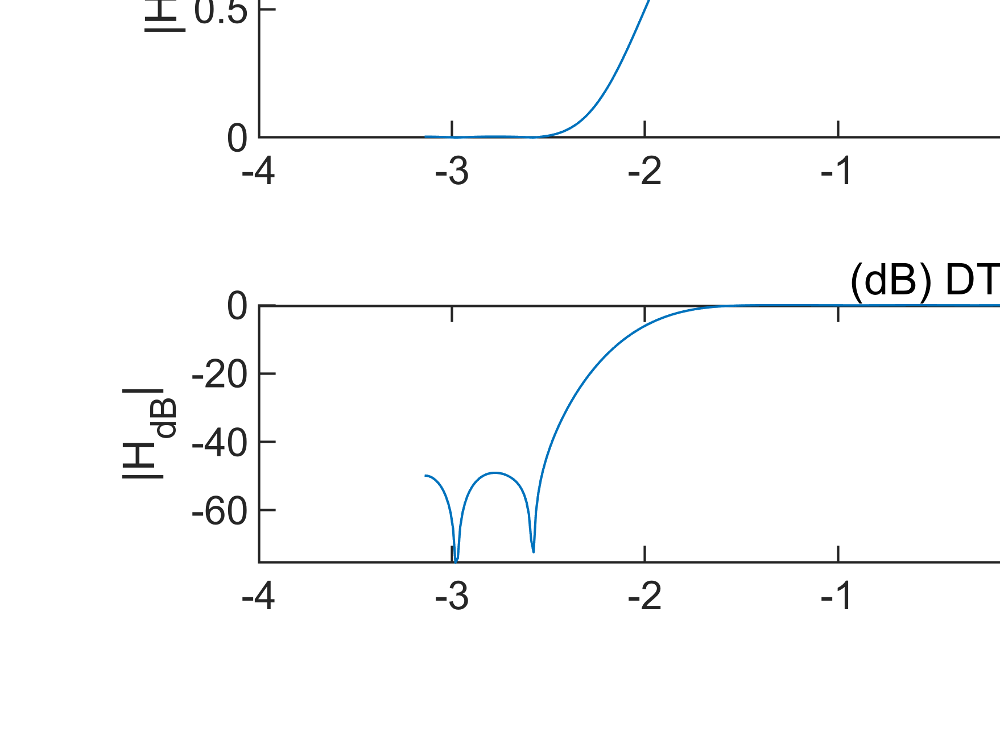
# 7.8 & 8.3 Filter Design Using the Kaiser Window
```matlab
clear, load("resource\nspeech2.mat")

h1 = kaiser(21, 0);
h2 = kaiser(21, 1);
h3 = kaiser(21, 5);

showFilter(h1, 'Kaiser Filter, \beta=0')
```

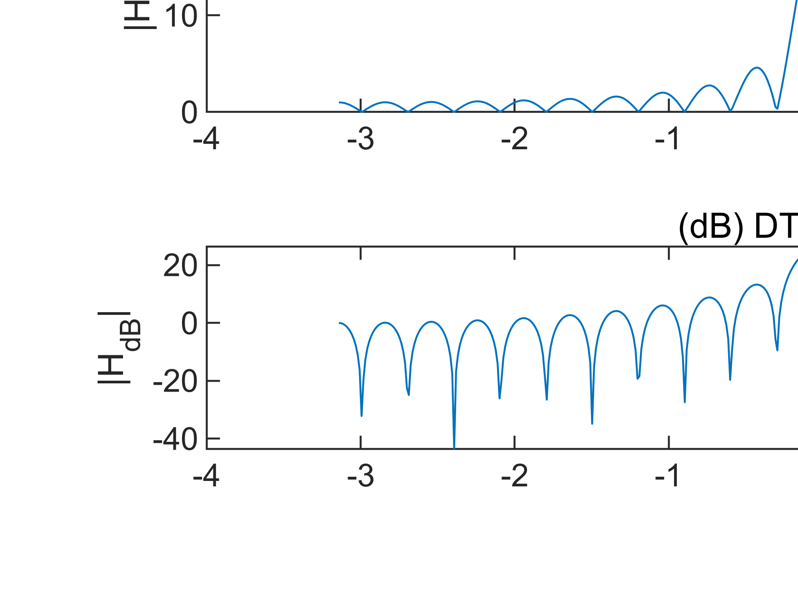

```matlab
showFilter(h2, 'Kaiser Filter, \beta=1')
```

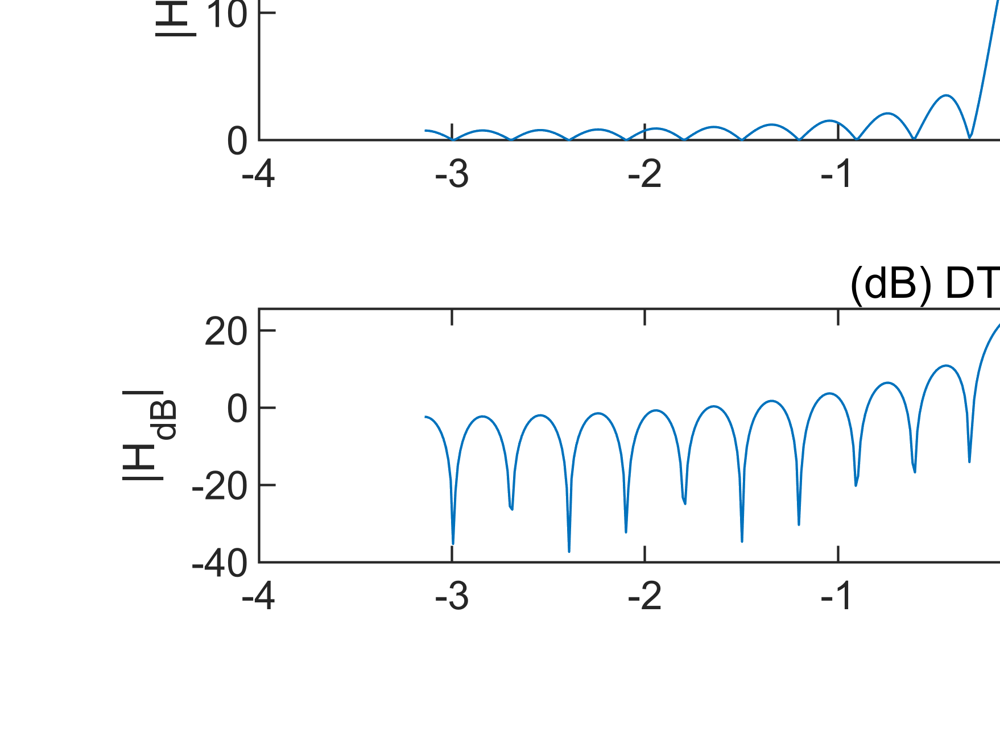

```matlab
showFilter(h3, 'Kaiser Filter, \beta=5')
```

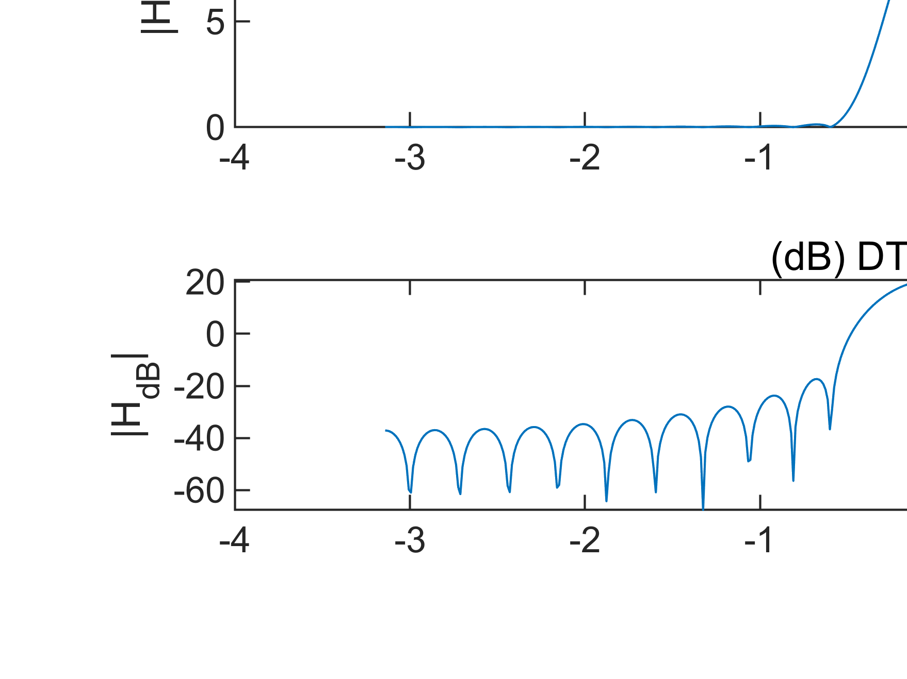

```matlab
function h = KaiserFilter(wp, ws, dp, ds)
    d = min(dp, ds);
    A = -20*log10(d)

    N = ceil(1+(A-8)/(2.285*(ws-wp)))

    if A<21
        beta = 0;
    elseif A>50
        beta = 0.1102*(A-8.7);
    else
        beta = 0.5842*(A-21)^0.4 + 0.07886*(A-21);
    end
    beta

    w = kaiser(N, beta);
    
    n = 0:N-1; wc = (wp+ws)/2;
    h_ideal = wc/pi * sinc(wc/pi * (n- (N-1)/2));

    h = h_ideal .* w.';
end

% wp, ws, dp, ds
wp=1.8; ws = 2.2, dp = 0.05; ds = 0.005;
```

```matlabTextOutput
ws = 2.2000
```

```matlab
h = KaiserFilter(wp, ws, dp, ds);
```

```matlabTextOutput
A = 46.0206
N = 43
beta = 4.0909
```

```matlab
showFilter(h, 'Kaiser Filter')
```

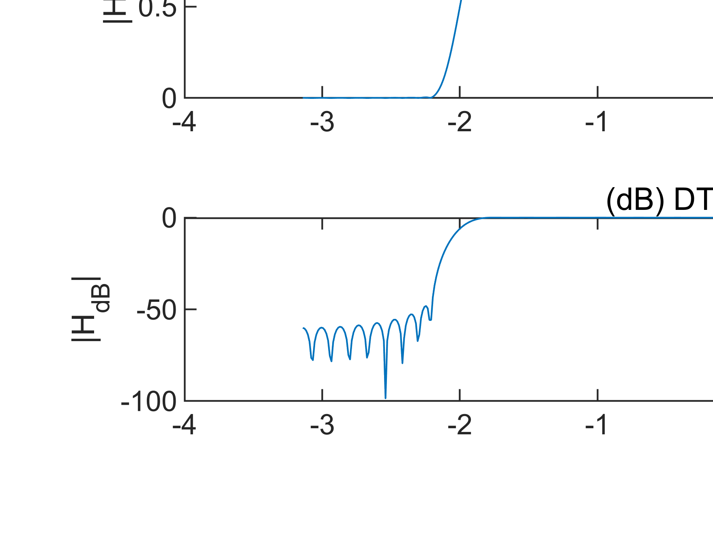

```matlab
[X, w] = DTFT(h, 512);

function analyzeBands(h, f, ripple, Title)

    wp = f(1); ws = f(2);
    dp = ripple(1); ds = ripple(2);

    [X, w] = DTFT(h, 512);
    figure
    subplot(311)
    plot(w, 20*log10(abs(X))), title('(dB) Whole Spectrum')
    xline([wp, -wp], '--g', 'LineWidth', 1.2)
    xline([ws, -ws], '--r', 'LineWidth', 1.2)
    
    subplot(312), passband = (abs(w)<=1.8);
    plot(w(passband), abs(X(passband))), title('Passband')
    dp_cal = max(abs(abs(X(passband))-1));
    yline(1+dp_cal , '--y', '1+d_p')
    yline(1-dp_cal , '--y', '1-d_p')
    yline(1, '--y')
    
    subplot(313), stopband = (abs(w)>=2.2);
    plot(w(stopband), abs(X(stopband))), title('Stopband')
    
    ds_cal = max(abs(X(stopband)));
    yline(ds_cal, '--y', 'd_s')

    sgtitle(Title)
end

analyzeBands(h,[1.8, 2.2], [0.05, 0.005],  'Kaiser Filter')
```

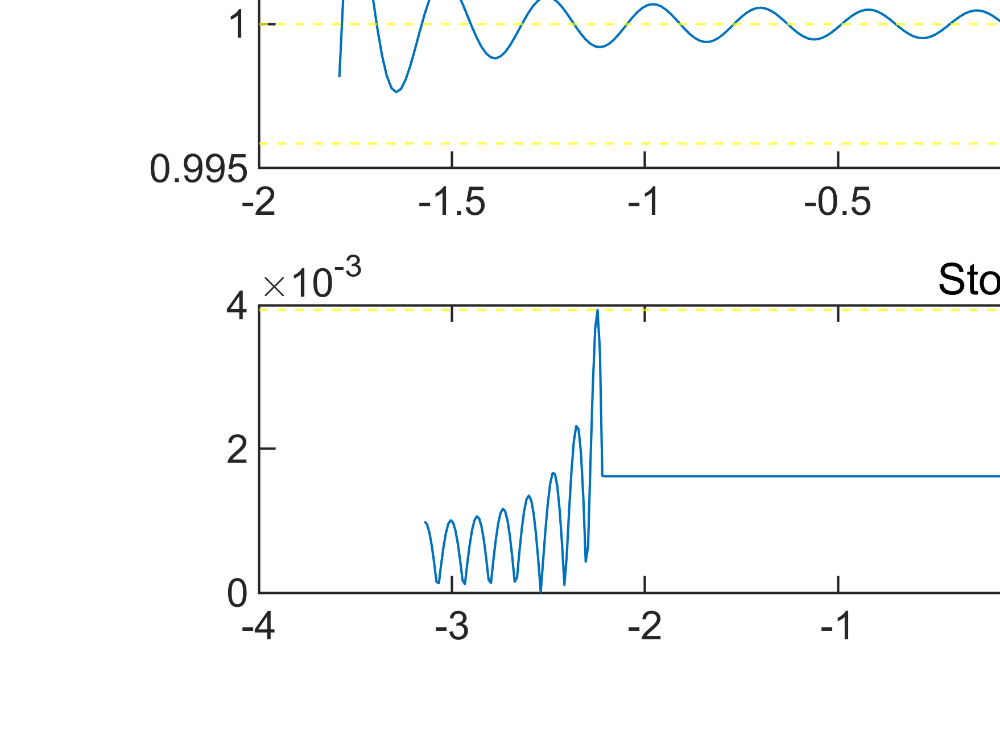

```matlab
function showSpeech(y, Title)
    [X, w] = DTFT(y(20001:20400), 512);
    plot(w, 20*log10(abs(X))), xlabel('\omega'), ylabel('Magnitude (dB)'), title(Title)
end
y_kaiser = conv(h, nspeech2);

% sound(conv(h, nspeech2))

figure
subplot(211)
showSpeech(nspeech2, 'Signal with Noise')
subplot(212)
showSpeech(y_kaiser, 'Filtered Signal'), sgtitle('Comparison of Signals')
```

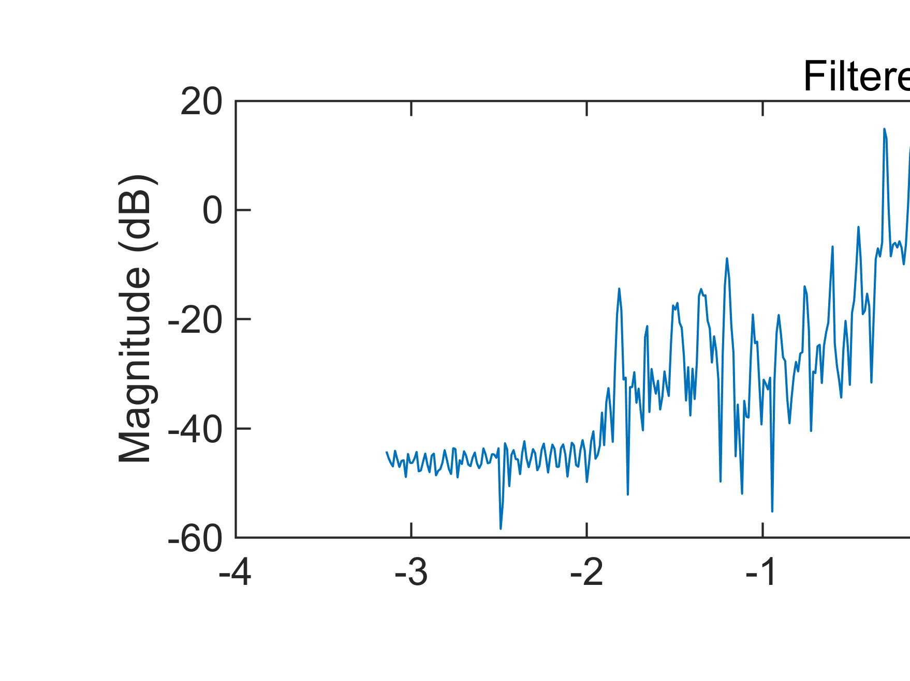

The frequencies of the noise (high frequencies) are filtered.


I can hear this clearly, so I filtered the signal correctly.

# 8.4 FIR Filter Design Using Parks\-McClellan Algorithm

The impulse response is just {b(1), b(2), ...}, starting from n=0.


```matlab
clear, load("resource\nspeech2.mat")

wp=1.8; ws = 2.2; dp = 0.05; ds = 0.005;

f = [wp, ws]; m = [1, 0]; ripple = [dp, ds];

[n, fo, mo, w] = firpmord(f, m, ripple, 2*pi);
b = firpm(n, fo, mo, w);

n
```

```matlabTextOutput
n = 25
```

```matlab

analyzeBands(b, [1.8, 2.2], [0.05, 0.005],  'Parks-McClellan Filter')
```

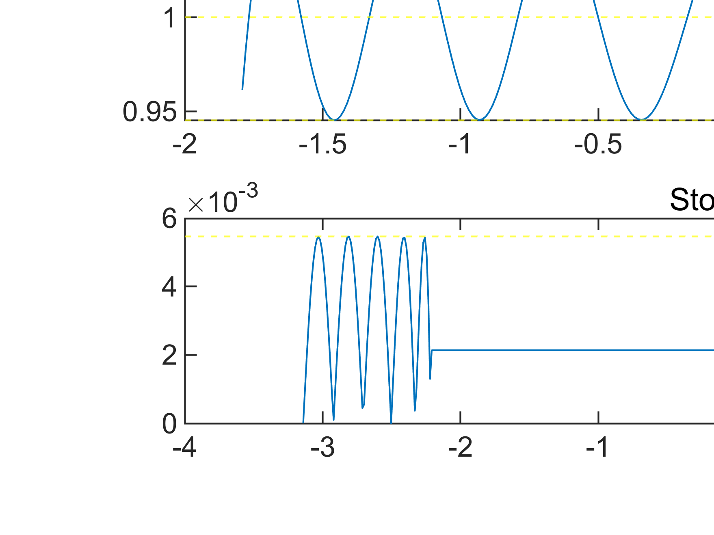

```matlab
h = KaiserFilter(wp, ws, dp, ds);
```

```matlabTextOutput
A = 46.0206
N = 43
beta = 4.0909
```

```matlab
analyzeBands(h, [1.8, 2.2], [0.05, 0.005],  'Kaiser Filter')
```


The P\-MC filter is shorter. Kaiser filter is smoother in the passband, and the stopband is smaller.

```matlab
y_pmc = conv(b, nspeech2); y_kaiser = conv(h, nspeech2);
figure
subplot(211)
showSpeech(y_pmc, 'Signal by Parks-McClellan Filter')
subplot(212)
showSpeech(y_kaiser, 'Signal by Kaiser Filter'), sgtitle('Comparison of Signals')
```

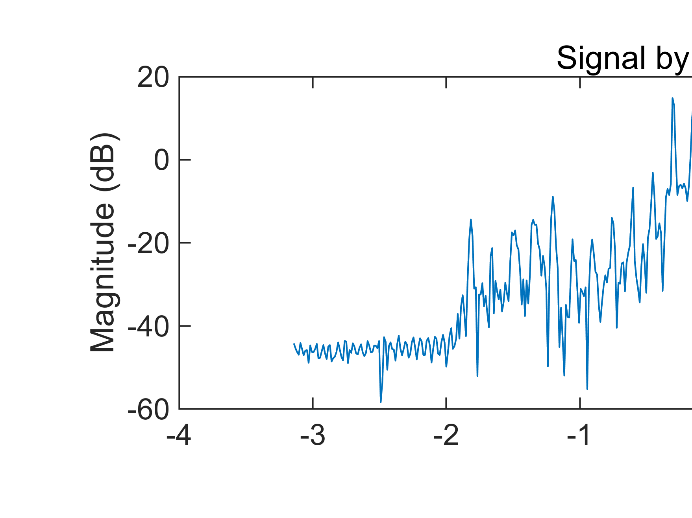

```matlab
sound([y_pmc; y_kaiser])
```

Minor noise can be heard by the PMC filter. Other differences are not evident.

