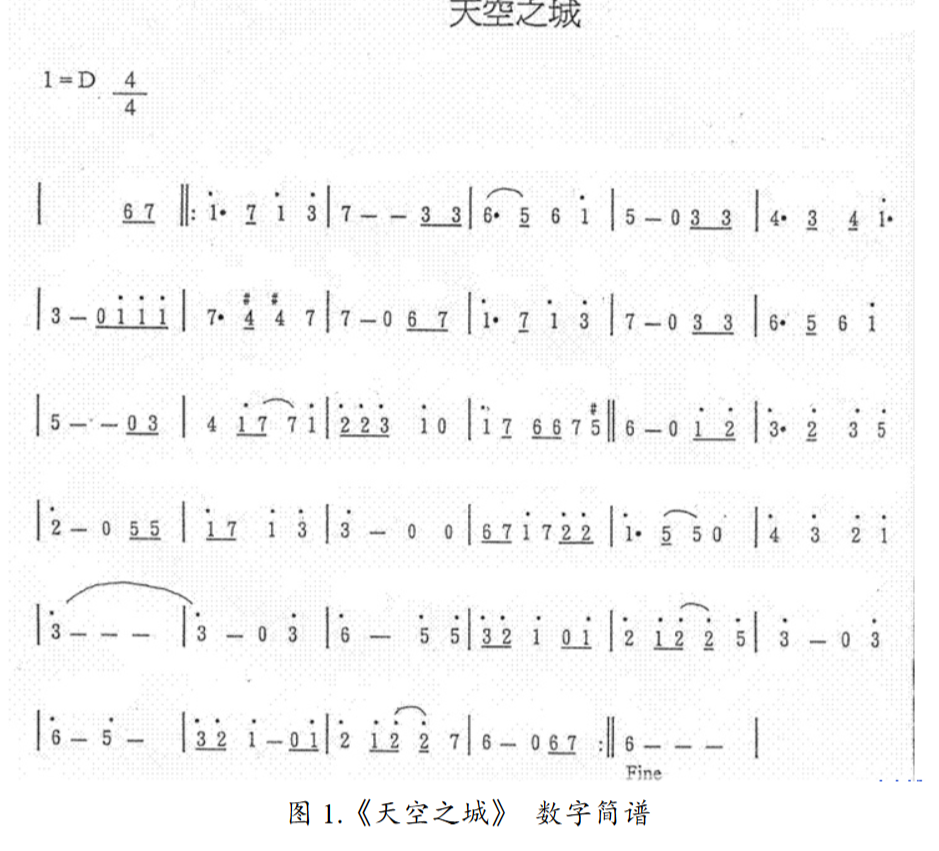
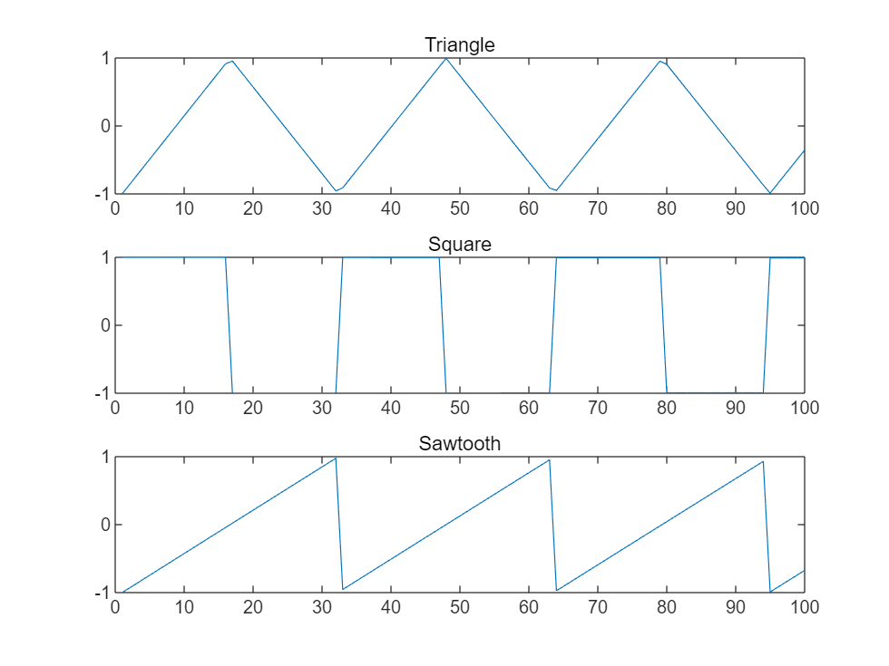
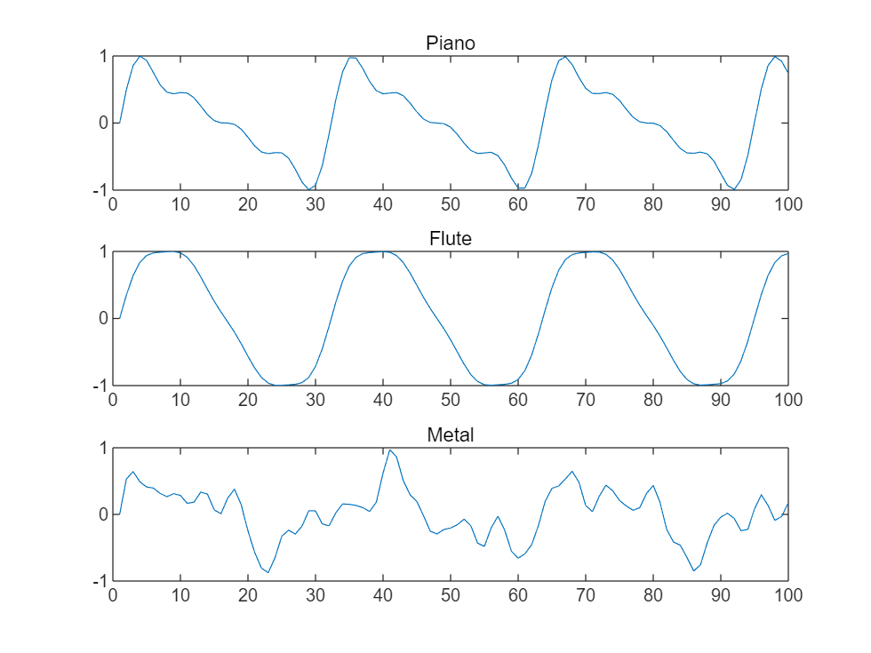

# Practice 1

7种音符，三个八度（低一、中、高一），三种升降调（降、原、升）

```matlab
frequencies = zeros(7, 3, 3);

for tone = 1:7
    for nOctave = -1:1
        for rising = -1:1
            frequencies(tone, nOctave+2, rising+2) = tone2freq(tone, nOctave, rising);
        end
    end
end

frequencies
```

```matlabTextOutput
frequencies = 
frequencies(:,:,1) =

1.0e+03 *

    0.2077    0.4153    0.8306
    0.2331    0.4662    0.9323
    0.2616    0.5233    1.0465
    0.2772    0.5544    1.1087
    0.3111    0.6223    1.2445
    0.3492    0.6985    1.3969
    0.3920    0.7840    1.5680

frequencies(:,:,2) =

1.0e+03 *

    0.2200    0.4400    0.8800
    0.2469    0.4939    0.9878
    0.2772    0.5544    1.1087
    0.2937    0.5873    1.1747
    0.3296    0.6593    1.3185
    0.3700    0.7400    1.4800
    0.4153    0.8306    1.6612

frequencies(:,:,3) =

1.0e+03 *

    0.2331    0.4662    0.9323
    0.2616    0.5233    1.0465
    0.2937    0.5873    1.1747
    0.3111    0.6223    1.2445
    0.3492    0.6985    1.3969
    0.3920    0.7840    1.5680
    0.4400    0.8800    1.7600

```
# Practice 2

3种升降调，7种调号

```matlab
% tone2freq(tone, scale, nOctave, rising)
frequencies = zeros(3, 7);

for rising = -1:1
    for scale = 1:7
        frequencies(rising + 2, scale) = tone2freq(1, scale, 0, rising);
    end
end

frequencies
```

```matlabTextOutput
frequencies = 3x7
  246.8231  277.0271  311.0066  329.4121  369.5268  415.3047  466.2739
  261.5000  293.5000  329.5000  349.0000  391.5000  440.0000  494.0000
  277.0496  310.9524  349.0931  369.7526  414.7798  466.1638  523.3748

```
# Practice 3
## Test
```matlab
fs = 8192;
melody = [gen_wave_3(1,1,0,0,1,fs), gen_wave_3(2,1,0,0,1,fs), gen_wave_3(3,1,0,0,1,fs)]
```

```matlabTextOutput
melody = 1x24576
         0    0.1992    0.3905    0.5661    0.7190    0.8431    0.9333    0.9861    0.9994    0.9726    0.9068    0.8046    0.6702    0.5089    0.3272    0.1323   -0.0678   -0.2653   -0.4521   -0.6207   -0.7645   -0.8776   -0.9555   -0.9951   -0.9948   -0.9546   -0.8761   -0.7625   -0.6183   -0.4493   -0.2623   -0.0648    0.1354    0.3301    0.5115    0.6725    0.8065    0.9081    0.9733    0.9995    0.9856    0.9322    0.8414    0.7169    0.5636    0.3877    0.1962   -0.0031   -0.2023   -0.3933

```

```matlab
sound(melody, fs)
```
## 天空之城

```matlab
scale = 2; baseLen = 0.2; fs = 8192;
% tone, nOctave, rising, len(eighth)
noteTable = [
    % [0,0,0,6];
    [6,0,0,1];
    [7,0,0,1];

    [1,1,0,3];
    [7,0,0,1];
    [1,1,0,2];
    [3,1,0,2];

    [7,0,0,6];
    [3,0,0,1];
    [3,0,0,1];

    [6,0,0,3];
    [5,0,0,1];
    [6,0,0,2];
    [1,1,0,2];

    [5,0,0,4];
    [0,0,0,2];
    [3,0,0,1];
    [3,0,0,1]
];
music_exp = [];
for m = 1:length(noteTable)
    note = num2cell(noteTable(m, :));
    [tone, nOctave, rising, mulLength] = note{:};
    music_exp = [music_exp, gen_wave_3(tone, scale, nOctave, rising, mulLength*baseLen, fs)];
end
sound(music_exp, fs)
% audiowrite('output\practice3.wav', music, fs)
```
# Practice 4
```matlab
scale = 2; baseLen = 0.2; fs = 8192;
% tone, nOctave, rising, len(eighth)
noteTable = [
    % [0,0,0,6];
    [6,0,0,1];
    [7,0,0,1];

    [1,1,0,3];
    [7,0,0,1];
    [1,1,0,2];
    [3,1,0,2];

    [7,0,0,6];
    [3,0,0,1];
    [3,0,0,1];

    % [6,0,0,3];
    % [5,0,0,1];
    % [6,0,0,2];
    % [1,1,0,2];
    % 
    % [5,0,0,4];
    % [0,0,0,2];
    % [3,0,0,1];
    % [3,0,0,1]
];
music_exp = []; music_linear = []; music_square = [];
for m = 1:length(noteTable)
    note = num2cell(noteTable(m, :));
    [tone, nOctave, rising, mulLength] = note{:};
    music_exp = [music_exp, gen_wave_4(tone, scale, nOctave, rising, mulLength*baseLen, fs, 'exp')];
    music_square = [music_square, gen_wave_4(tone, scale, nOctave, rising, mulLength*baseLen, fs, 'square')];
    music_linear = [music_linear, gen_wave_4(tone, scale, nOctave, rising, mulLength*baseLen, fs, 'linear')];
end
% sound(music_exp, fs)
```

```matlab
subplot(311),sgtitle('Different Decay Types')
plot(music_exp), title('Exponential')
subplot(312)
plot(music_square), title('Quadratic')
subplot(313)
plot(music_linear), title('Linear')
```


```matlab
% audiowrite('output\practice4_exp.wav', music_exp, fs)
% audiowrite('output\practice4_linear.wav', music_linear, fs)
% audiowrite('output\practice4_square.wav', music_square, fs)
```

I prefer linear decay.

```matlab
clear
fs = 8192
```

```matlabTextOutput
fs = 8192
```

```matlab
% waves = gen_wave_5(tone, scale, nOctave, rising, rhythm, fs, decayType, harmonyType)
note0 = gen_wave_5(1,1,0,0,1,fs,"linear","triangle");
note1 = gen_wave_5(1,1,0,0,1,fs,"linear","square");
note2 = gen_wave_5(1,1,0,0,1,fs,"linear","sawtooth");
note3 = gen_wave_5(1,1,0,0,1,fs,"linear","piano");
note4 = gen_wave_5(1,1,0,0,1,fs,"linear","flute");
note5 = gen_wave_5(1,1,0,0,1,fs,"linear","comp");
```

```matlab
sound([note3,note4,note5],fs)
% sound(note7,fs)
```

```matlab
figure
subplot(311)
plot(note0(1:100)), title('Triangle')
subplot(312)
plot(note1(1:100)), title('Square')
subplot(313)
plot(note2(1:100)), title('Sawtooth')
```



```matlab
figure
subplot(311)
plot(note3(1:100)), title('Piano')
subplot(312)
plot(note4(1:100)), title('Flute')
subplot(313)
plot(note5(1:100)), title('Metal')
```



```matlab
scale = 1; baseLen = 0.22; fs = 8192;
% tone, nOctave, rising, len(eighth)
noteTable1 = [
    % 1
    [6,0,0,1];
    [6,0,0,1];
    [0,0,0,2];
    [4,0,1,1];
    [4,0,1,1];
    [0,0,0,2];
    % 2
    [0,0,0,3];
    [6,0,0,1];
    [4,0,1,1];
    [3,0,0,1];
    [2,0,1,1];
    [1,0,1,1];
    % 3
    [3,0,0,1];
    [3,0,0,1];
    [0,0,0,2];
    [4,0,1,1];
    [4,0,1,1];
    [0,0,0,2]
    % 4
    [0,0,0,8];
    % 5
    [6,0,0,1];
    [6,0,0,1];
    [0,0,0,2];
    [4,0,1,1];
    [4,0,1,1];
    [0,0,0,2];
    % 6
    [0,0,0,3];
    [1,0,1,1];
    [4,0,1,1];
    [3,0,0,1];
    [2,0,1,.2];
    [3,0,0,.2];
    [2,0,1,.6];
    [1,0,1,1];
    % 7
    [3,0,0,1];
    [3,0,0,1];
    [0,0,0,2];
    [4,0,1,1];
    [4,0,1,1];
    [0,0,0,2];
    % 8
    [1,0,1,1];
    [1,0,1,1];
    [1,0,1,1];
    [1,0,1,1];
    [3,0,0,1];
    [3,0,0,1];
    [3,0,1,1];
    [3,0,1,1];

    %9
    [1,0,1,2];
    [1,0,1,1];
    [1,0,1,1];
    [1,0,1,2];
    [1,0,1,1];
    [1,0,1,1];
    %10
    [1,0,1,1];
    [1,0,1,1];
    [1,0,1,2];
    [6,0,0,2];
    [1,0,1,1];
    [1,0,1,1];
    %11
    [3,0,0,1];
    [3,0,0,1];
    [0,0,0,2]
    [3,0,0,1];
    [4,0,1,1];
    [0,0,0,1];
    [1,0,1,5];
    %12
    [0,0,0,4];

    %13
    [0,0,0,4]
    [4,0,1,2]
    [4,0,1,1]
    [4,0,1,1]
    %14
    [1,0,1,4]
    [0,0,0,4]
    %15
    [0,0,0,4]
    [7,-1,0,1]
    [7,-1,0,1]
    [1,0,1,2]
    %16
    [7,-1,0,4]
    [0,0,0,4]

    %17
    [1,0,1,2];
    [1,0,1,1];
    [1,0,1,1];
    [1,0,1,2];
    [1,0,1,1];
    [1,0,1,1];
    %18
    [1,0,1,1];
    [1,0,1,1];
    [1,0,1,2];
    [6,0,0,2];
    [1,0,1,1];
    [1,0,1,1];
    %19
    [3,0,0,1]
    [3,0,0,1]
    [3,0,0,1]
    [1,0,1,1]
    [3,0,0,2]
    [4,0,1,1]
    [1,0,1,3]
    %20
    [0,0,0,6]
    %21
    [0,0,0,4]
    [4,0,1,1]
    [4,0,1,1]
    [4,0,1,2]
    %22
    [4,0,1,4]
    [0,0,0,2]
    [5,0,1,1]
    [6,0,0,1]
    %23
    [5,0,1,1]
    [5,0,1,1]
    [6,0,0,2]
    [5,0,1,2]
    [0,0,0,2]
    %24
    [0,0,0,4]
    [6,0,0,2]
    [5,0,1,2]
    %END
    [1,0,1,1]
    [2,0,0,1]
    [3,0,0,1]
    [5,0,1,4]

];

noteTable2 = [
    % 1
    [4,-1,1,1];
    [4,-1,1,1];
    [0,0,0,2];
    [4,-2,1,1];
    [4,-2,1,1];
    [0,0,0,2];
    %2
    [0,0,0,8];
    %3
    [1,-1,1,1];
    [1,-1,1,1];
    [0,0,0,2]
    [1,-1,1,1];
    [1,-1,1,1];
    [0,0,0,2];
    %4
    [1,-1,1,1];
    [1,-1,1,1];
    [1,-1,1,1];
    [1,-1,1,1];
    [3,-1,0,1];
    [3,-1,0,1];
    [3,-1,1,1];
    [3,-1,1,1];
    %5
    [4,-1,1,1];
    [4,-1,1,1];
    [0,0,0,2];
    [4,-2,1,1];
    [4,-2,1,1];
    [0,0,0,2];
    %6
    [0,0,0,8];
    %7
    [1,-1,1,1];
    [1,-1,1,1];
    [0,0,0,2]
    [1,-1,1,1];
    [1,-1,1,1];
    [0,0,0,2];
    %8
    [1,-1,1,1];
    [1,-1,1,1];
    [1,-1,1,1];
    [1,-1,1,1];
    [3,-1,0,1];
    [3,-1,0,1];
    [3,-1,1,1];
    [3,-1,1,1];

    %9
    [4,-2,1,1]
    [1,-1,1,1]
    [4,-1,1,2]
    [4,-2,1,1]
    [1,-1,1,1]
    [4,-1,1,2]
    %10
    [4,-2,1,1]
    [1,-1,1,1]
    [4,-1,1,2]
    [4,-2,1,1]
    [1,-1,1,1]
    [4,-1,1,2]
    %11
    [1,-1,1,1]
    [3,-1,0,1]
    [5,-1,1,1]
    [3,-1,0,1]
    [1,-1,1,1]
    [3,-1,0,1]
    [5,-1,1,1]
    [3,-1,0,1]
    %12
    [1,-1,1,1]
    [3,-1,0,1]
    [5,-1,1,1]
    [3,-1,0,1]
    [1,-1,1,1]
    [3,-1,0,1]
    [3,-1,0,1]
    [3,-1,1,1]

    %13
    [4,-1,1,1]
    [6,-1,0,1]
    [1,0,1,1]
    [6,-1,0,1]
    [4,-1,1,1]
    [6,-1,0,1]
    [1,0,1,2]

    %14->22
    [4,-2,1,1]
    [1,-1,1,1]
    [4,-1,1,1]
    [1,-1,1,1]
    [4,-2,1,1]
    [1,-1,1,1]
    [4,-1,1,1]
    [1,-1,1,1]
    %15
    [3,-2,0,1]
    [7,-2,0,1]
    [3,-1,0,1]
    [7,-2,0,1]
    [3,-2,0,1]
    [7,-2,0,1]
    [3,-1,0,2]
    %16
    [3,-2,0,1]
    [7,-2,0,1]
    [3,-1,0,1]
    [5,-1,1,1]
    [1,-1,1,1]
    [3,-1,0,1]
    [5,-1,1,1]
    [1,0,1,1]
    %17
    [4,-1,1,1]
    [6,-1,0,1]
    [1,0,1,2]
    [4,-1,1,1]
    [6,-1,0,1]
    [1,0,1,2]
    %18
    [4,-1,1,1]
    [6,-1,0,1]
    [1,0,1,2]
    [4,-1,1,1]
    [6,-1,0,1]
    [1,0,1,2]
    %19->27
    [1,-1,1,1]
    [3,-1,0,1]
    [5,-1,1,2]
    [1,-1,1,1]
    [3,-1,0,1]
    [5,-1,1,2]
    %20
    [1,-1,1,1]
    [3,-1,0,1]
    [5,-1,1,1]
    [3,-1,0,1]
    [1,-1,1,1]
    [3,-1,0,1]
    [5,-1,1,1]
    [3,-1,0,1]
    %21
    [4,-2,1,1]
    [1,-1,1,1]
    [4,-1,1,1]
    [1,-1,1,1]
    [4,-2,1,1]
    [1,-1,1,1]
    [4,-1,1,2]
    %22
    [4,-2,1,1]
    [1,-1,1,1]
    [4,-1,1,1]
    [1,-1,1,1]
    [4,-2,1,1]
    [1,-1,1,1]
    [4,-1,1,1]
    [1,-1,1,1]
    %23
    [3,-2,0,1]
    [7,-2,0,1]
    [3,-1,0,2]
    [3,-2,0,1]
    [7,-2,0,1]
    [3,-1,0,1]
    [7,-2,0,1]
    %END
    [3,-2,0,1]
    [5,-2,1,1]
    [7,-2,0,1]
    [3,-1,0,1]
    [4,-1,1,2]
    [1,-1,1,2]
    
];
music1 = [];
for m = 1:length(noteTable1)
    note = num2cell(noteTable1(m, :));
    [tone, nOctave, rising, mulLength] = note{:};
    music1 = [music1, ...
        gen_wave_5(tone, scale, nOctave, rising, mulLength*baseLen, fs, ...
        'square', 'triangle')];
end
% music1

music2 = [];
for m = 1:length(noteTable2)
    note = num2cell(noteTable2(m, :));
    [tone, nOctave, rising, mulLength] = note{:};
    music2 = [music2, ...
        gen_wave_5(tone, scale, nOctave, rising, mulLength*baseLen, fs, ...
        'square', 'square')];
end
music2 = music2 * .3
```

```matlabTextOutput
music2 = 1x345986
    0.3000    0.2998    0.2995    0.2993    0.2991    0.2988    0.2986    0.2984    0.2981    0.2979    0.2977    0.2974    0.2972    0.2970    0.2967    0.2965    0.2963    0.2960    0.2958    0.2956    0.2954    0.2951    0.2949   -0.2947   -0.2944   -0.2942   -0.2940   -0.2937   -0.2935   -0.2933   -0.2930   -0.2928   -0.2926   -0.2924   -0.2921   -0.2919   -0.2917   -0.2914   -0.2912   -0.2910   -0.2907   -0.2905   -0.2903   -0.2901   -0.2898    0.2896    0.2894    0.2891    0.2889    0.2887

```

```matlab

N1 = length(music1)
```

```matlabTextOutput
N1 = 358600
```

```matlab
N2 = length(music2)
```

```matlabTextOutput
N2 = 345986
```

```matlab

if N1 > N2
    music2 = [music2,zeros(1,N1-N2)]
elseif N1 < N2
    music1 = [music1,zeros(1,N2-N1)]
end
```

```matlabTextOutput
music2 = 1x358600
    0.3000    0.2998    0.2995    0.2993    0.2991    0.2988    0.2986    0.2984    0.2981    0.2979    0.2977    0.2974    0.2972    0.2970    0.2967    0.2965    0.2963    0.2960    0.2958    0.2956    0.2954    0.2951    0.2949   -0.2947   -0.2944   -0.2942   -0.2940   -0.2937   -0.2935   -0.2933   -0.2930   -0.2928   -0.2926   -0.2924   -0.2921   -0.2919   -0.2917   -0.2914   -0.2912   -0.2910   -0.2907   -0.2905   -0.2903   -0.2901   -0.2898    0.2896    0.2894    0.2891    0.2889    0.2887

```

```matlab

% sound(music1, fs)
% sound(music2, fs)
sound(music1+music2, fs)
```

```matlab
audiowrite('output\Группа_крови.wav', music1+music2, fs)
```

```matlabTextOutput
警告: 数据在写入文件期间被裁剪。
```
