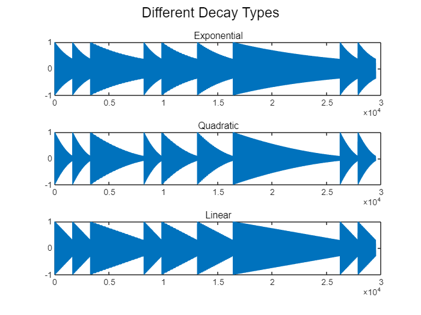

# Report (Simplified)

```matlab
function freq = tone2freq(tone, varargin)

    if nargin == 3
        % tone2freq(tone, nOctave, rising)
        nOctave = varargin{1};
        rising = varargin{2};
        scale = 6;
    elseif nargin == 4
        % tone2freq(tone, scale, nOctave, rising)
        scale = varargin{1};
        nOctave = varargin{2};
        rising = varargin{3};
    else
        error('InputError:InvalidNumOfInput', 'incorrect function call format')
    end
    if ~ismember(tone, 1:7)
        error('`tone` must be an integer between 1 and 7');
    end
    if ~ismember(nOctave, -4:4)
        error('`nOctave` must be an integer between -4 and 4')
    end
    if ~ismember(rising, -1:1)
        error('`rising` must be an integer between -1 and 1')
    end
    
    persistent tone2temper;
    persistent scale2freq;
    % Don't need to initialize it every time

    if isempty(tone2temper)
        tone2temper = [0,2,4,5,7,9,11];
        % mapping from number to position in 12 Equal Temperament
    end

    if isempty(scale2freq)
        scale2freq = [261.5, 293.5, 329.5, 349, 391.5, 440, 494];
        % TODO: More scales?
    end

    num = tone2temper(tone) + rising;
    tonic = scale2freq(scale);  % 主音
    
    flag_lowerOctave = 0;
    flag_higherOctave = 0;
        
    if num <= 0
        num = num + 12;
        flag_lowerOctave = 1; % Too low. Move to lower octave
    end
    
    if num > 12
        num = num - 12;
        flag_higherOctave = 1;
    end

    freq = tonic*2^(num/12+nOctave-flag_lowerOctave+flag_higherOctave);

end
```

# Practice 1

7种音符，三个八度（低一、中、高一），三种升降调（降、原、升）

```matlab
frequencies = zeros(7, 3, 3);

for tone = 1:7
    for nOctave = -1:1
        for rising = -1:1
            frequencies(tone, nOctave+2, rising+2) = tone2freq(tone, nOctave, rising);
        end
    end
end
```

```matlabTextOutput
frequencies(:,:,1) =

1.0e+03 *

    0.2077    0.4153    0.8306
    0.2331    0.4662    0.9323
    0.2616    0.5233    1.0465
    0.2772    0.5544    1.1087
    0.3111    0.6223    1.2445
    0.3492    0.6985    1.3969
    0.3920    0.7840    1.5680

```
# Practice 2

3种升降调，7种调号

```matlab
% tone2freq(tone, scale, nOctave, rising)
frequencies = zeros(3, 7);

for rising = -1:1
    for scale = 1:7
        frequencies(rising + 2, scale) = tone2freq(1, scale, 0, rising);
    end
end

frequencies
```

```matlabTextOutput
frequencies = 3x7
  246.8231  277.0271  311.0066  329.4121  369.5268  415.3047  466.2739
  261.5000  293.5000  329.5000  349.0000  391.5000  440.0000  494.0000
  277.0496  310.9524  349.0931  369.7526  414.7798  466.1638  523.3748

```
# Practice 3
## 天空之城
```matlab
scale = 2; baseLen = 0.2; fs = 8192;
% tone, nOctave, rising, len(eighth)
noteTable = [
    [6,0,0,1];
    [7,0,0,1];

    [1,1,0,3];
    [7,0,0,1];
    [1,1,0,2];
    [3,1,0,2];
];
music_exp = [];
for m = 1:length(noteTable)
    note = num2cell(noteTable(m, :));
    [tone, nOctave, rising, mulLength] = note{:};
    music_exp = [music_exp, gen_wave_3(tone, scale, nOctave, rising, mulLength*baseLen, fs)];
end
sound(music_exp, fs)
% audiowrite('output\practice3.wav', music, fs)
```
# Practice 4
```matlab
scale = 2; baseLen = 0.2; fs = 8192;
% tone, nOctave, rising, len(eighth)
noteTable = [
    [6,0,0,1];
    [7,0,0,1];

    [1,1,0,3];
    [7,0,0,1];
    [1,1,0,2];
    [3,1,0,2];
];
music_exp = []; music_linear = []; music_square = [];
for m = 1:length(noteTable)
    note = num2cell(noteTable(m, :));
    [tone, nOctave, rising, mulLength] = note{:};
    music_exp = [music_exp, gen_wave_4(tone, scale, nOctave, rising, mulLength*baseLen, fs, 'exp')];
    music_square = [music_square, gen_wave_4(tone, scale, nOctave, rising, mulLength*baseLen, fs, 'square')];
    music_linear = [music_linear, gen_wave_4(tone, scale, nOctave, rising, mulLength*baseLen, fs, 'linear')];
end
% sound(music_exp, fs)
```

```matlab
subplot(311),sgtitle('Different Decay Types')
plot(music_exp), title('Exponential')
subplot(312)
plot(music_square), title('Quadratic')
subplot(313)
plot(music_linear), title('Linear')
```



```matlab
% audiowrite('output\practice4_exp.wav', music_exp, fs)
% audiowrite('output\practice4_linear.wav', music_linear, fs)
% audiowrite('output\practice4_square.wav', music_square, fs)
```

I prefer linear decay. But for different scenarios, these are all good choices.

# Practice 5

I create multiple harmony types:

```matlab
function waves = gen_wave_5(tone, scale, nOctave, rising, rhythm, fs, decayType, harmonyType)

    if tone == 0  % no sound
        waves = zeros(1, floor(fs*rhythm));
        return
    end
    % tone2freq(tone, scale, nOctave, rising)
    f = tone2freq(tone, scale, nOctave, rising);
    t = linspace(0, rhythm, fs*rhythm);

    switch harmonyType
        case "sin"
            waves = sin(2*pi*f*t);
        case "triangle"
            waves = sawtooth(2*pi*f*t, 0.5);
        case "square"
            waves = square(2*pi*f*t);
        case "sawtooth"
            waves = sawtooth(2*pi*f*t);
        case "piano"
            waves = 0.6*sin(2*pi*f*t) + 0.3*sin(2*pi*2*f*t) + 0.2*sin(2*pi*3*f*t) + 0.15*sin(2*pi*4*f*t);
        case "flute"
            waves = 0.8*sin(2*pi*f*t) + 0.1*sin(2*pi*2*f*t) + 0.05*sin(2*pi*3*f*t) + 0.05*sin(2*pi*4*f*t);
        case "metal"
            waves = 0.5*sin(2*pi*f*t) + ...        
              0.3*sin(2*pi*2.5*f*t) + ...    % non-harmonic
              0.2*sin(2*pi*4*f*t) + ...    
              0.15*sin(2*pi*5.7*f*t) + ...   % non-harmonic
              0.1*sin(2*pi*8*f*t);           % super high
        case "fmbell"
            waves = 0.5*sin(2*pi*f*t) + 0.3*sin(2*pi*2.5*f*t) + 0.2*sin(2*pi*4*f*t) + 0.1*sin(2*pi*5.7*f*t);
        case "subbass"
            waves = 0.9*sin(2*pi*f*t) + 0.2*sin(2*pi*2*f*t) + 0.1*sin(2*pi*3*f*t) + 0.05*sin(2*pi*4*f*t);
        case "violin"
            waves = 0.6*sin(2*pi*f*t) + ...
               0.4*sin(2*pi*2*f*t) + ...
               0.3*sin(2*pi*3*f*t) + ...
               0.2*sin(2*pi*4*f*t);
    end
    
    waves = waves/max(waves);

    switch decayType
        case "exp"
            decay = exp(-t / rhythm);
        case "linear"
            decay = linspace(1, 0.3, fs * rhythm);
        case "square"
            decay = (1 - t * 0.7 / rhythm).^2;
        otherwise
            error("Wrong decayType");
    end

    waves = waves.*decay;
end
```


```matlab
clear
fs = 8192;
```

```matlab
% waves = gen_wave_5(tone, scale, nOctave, rising, rhythm, fs, decayType, harmonyType)
note0 = gen_wave_5(1,1,0,0,1,fs,"linear","triangle");
note1 = gen_wave_5(1,1,0,0,1,fs,"linear","square");
note2 = gen_wave_5(1,1,0,0,1,fs,"linear","piano");
note3 = gen_wave_5(1,1,0,0,1,fs,"linear","flute");
note4 = gen_wave_5(1,1,0,0,1,fs,"linear","metal");
note5 = gen_wave_5(1,1,0,0,1,fs,"linear","fmbell");
note6 = gen_wave_5(1,1,0,0,1,fs,"linear","subbass");
note7 = gen_wave_5(1,1,0,0,1,fs,"linear","violin");
```


Note that the ratio of different frequency parts are crucial to the timbre of sound. By adding non-harmonic parts and super high parts, the sound is more sharp and "metallic". GPT says that the timbre in the reference PDF is flute, whose higher parts are relatively low.

However, it shall be noted that adjusting harmonics is not enough. Changing the decay type is important. What's more, ADSR (Attack-Decay-Sustain-Release) model is better in simulating the actual sound.

# My Song: Группа крови (血液型)

Note that because I love 8-Bit and 16-Bit music, I chose timbres that simulates these kinds of music which is "metallic". It may sound unnatural to some people.

I chose the high channel to be triangle wave with linear decay, and the low channel to be Sub Bass with exponential decay. This produces a sharper high notes and thicker low notes.

```matlab
scale = 1; baseLen = 0.22; fs = 8192;
% tone, nOctave, rising, len(eighth)
... % Note table is ignored in this simplified report. See the whole table in full report.
music1 = [];
for m = 1:length(noteTable1)
    note = num2cell(noteTable1(m, :));
    [tone, nOctave, rising, mulLength] = note{:};
    music1 = [music1, ...
        gen_wave_5(tone, scale, nOctave, rising, mulLength*baseLen, fs, ...
        'linear', 'triangle')];
end
% music1

music2 = [];
for m = 1:length(noteTable2)
    note = num2cell(noteTable2(m, :));
    [tone, nOctave, rising, mulLength] = note{:};
    music2 = [music2, ...
        gen_wave_5(tone, scale, nOctave, rising, mulLength*baseLen, fs, ...
        'exp', 'subbass')];
end
music2 = music2 * .3
```

```matlab
N1 = length(music1)
N2 = length(music2)
if N1 > N2
    music2 = [music2,zeros(1,N1-N2)]
elseif N1 < N2
    music1 = [music1,zeros(1,N2-N1)]
end % The lengths may have some

sound(music1+music2, fs)
audiowrite('output\Группа_крови.wav', music1+music2, fs)
```
